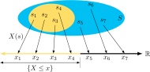

## El problema inicial: Variable aleatoria

!!! tip "Por qué necesitamos variables aleatorias"
    Los conjuntos \( S_1 = \left\{ \text{todos los equipos del campeonato nacional} \right\} \) o  
    \( S_2 = \left\{ \text{los colores favoritos de los estudiantes de esta clase} \right\} \) son útiles en la descripción de ciertos eventos,  
    pero no permiten la *manipulación numérica*.

    - Este espacio de eventos contiene conjuntos **abstractos**.
    - Necesitamos **números** para sumar, restar, multiplicar, dividir...
    - Necesitamos **funciones** para diferenciar, integrar...

!!! tip "Aquí es útil, entonces, la variable aleatoria..."

---

## Variable aleatoria

### Definición

!!! tip "Definición de variable aleatoria"
    Para un espacio de eventos \( S \), una **variable aleatoria** es cualquier regla que asocia cada resultado elemental de \( S \) con **un número**.  
    Es decir, es una **función** cuyo dominio es el espacio (quizá abstracto) de eventos o muestras, y cuyo rango es algún subconjunto de los números reales.

La notación \( X(s) = x \) significa que \( x \) es el valor asociado por \( X \) con el evento elemental \( s \).

---

## Pero… Una observación necesaria

!!! tip "Nota sobre el nombre"
    Las variables aleatorias *ni son variables, ni son aleatorias*.  
    \( X(s) \) es una **función** y es *determinística*, pero describe el comportamiento de un fenómeno aleatorio subyacente.  
    (Por tanto, se trata de un nombre poco apropiado. En inglés: *misnomer*.)

---

## Requisitos para la construcción de variables aleatorias

- **Un espacio de probabilidades** \((S, P)\): contiene todos los eventos elementales \( S \) y sus probabilidades asociadas \( P \).
- **Una función de mapeo** \( X \): que mapea cada \( s \in S \) a un único punto \( x \in \mathbb{R} \).
- **Una relación de dualidad** de la probabilidad: si \( B \subseteq \mathbb{R} \), entonces  
  la probabilidad del evento \( X(s) = B \) es equivalente a la del conjunto  
  \( A = X^{-1}(B) \in S \), que contiene todos los \( s \in S \) que se mapean a \( B \) bajo \( X \).

\[
X(s \in A) = B \qquad A = X^{-1}(B) \in S \qquad P(B) = P(A)
\]

---

## Condiciones para que una función sea variable aleatoria

!!! tip "Nota"
    *va* será la abreviación de “variable aleatoria”. En inglés se utiliza **rv**, de *random variable*.

Algunas condiciones debe cumplir \( X(s) \) para ser una *va*:

1. Una variable aleatoria es una función **no multivaluada**: todo punto en \( S \) corresponde a un solo valor de la *va*.

    

    !!! tip "Ejemplo negativo"
        Esto **no** representa el mapeo de una *va*.

---

2. El conjunto \( \{X \leq x\} \) existe y es un evento para cualquier número real \( x \).  
   Corresponde a los puntos \( s \) en \( S \) para los que \( X(s) \leq x \).

   

!!! tip "Probabilidad acumulada"
    La probabilidad \( P\left\{X \leq x\right\} \) es igual a la suma de las probabilidades de todos los \( s \) correspondientes a \( \left\{X \leq x\right\} \).

---

3. Las probabilidades de los eventos \( \{X = \infty\} \) y \( \{X = -\infty\} \) son cero:

\[
P\{X = -\infty\} = 0 \qquad P\{X = \infty\} = 0
\]

\( X(s) \) puede ser \( -\infty \) o \( \infty \) para algunos \( s \), pero su probabilidad será cero.

!!! tip "Importancia"
    Como se especifica más adelante, esto es necesario para que su "función de densidad" tenga un área total *finita*.

---

## Variables aleatorias **discretas**

!!! tip "Definición"
    Una variable aleatoria discreta es una *va* cuyos valores posibles constituyen un:
    - conjunto **finito**, o
    - conjunto infinito **enumerable**.

### Ejemplos

- Las caras de un dado
- La población mundial
- Otros ejemplos que se mapean en \( \mathbb{N} \)

!!! tip "Asignación de probabilidades"
    En una variable aleatoria discreta, la asignación de probabilidades se hace en valores discretos, ya sean finitos o infinitos enumerables. En este caso, están mapeados en un subconjunto de \( \mathbb{N} \).

---

### Variables aleatorias continuas

!!! tip "Definición"
    Una **variable aleatoria continua** es aquella que cumple con las siguientes condiciones:
    
    1. Su conjunto de valores posibles está formado por todos los números dentro de un intervalo de la recta real (por ejemplo, de \( 0 \) a \( +\infty \)), o por la unión disjunta de varios intervalos.
    2. Ningún valor individual tiene una probabilidad positiva. Es decir, para cualquier valor \( c \), se cumple que:  
       \[
       P(X = c) = 0
       \]

#### Ejemplo

La estatura de los habitantes de un país es una variable aleatoria continua.  
Pero, ¿cuál es la probabilidad de que una persona mida **exactamente** \( 52\pi \) cm?

!!! tip "Resultado"
    La respuesta es cero. En una variable aleatoria continua, la probabilidad de que ocurra un valor exacto es cero.

---

**Figura:** En una variable aleatoria continua, la asignación de probabilidades se hace en una sección o toda la recta real. Debido a que hay infinitos posibles resultados, la probabilidad de ocurrencia de exactamente un valor en particular es cero.

---

### Variable 1: Distribución Inverse Gaussian (`invgauss`)

Parámetros:  
$ \mu = 1.2466 $, $ \text{loc} = -0.0765 $, $ \text{scale} = 1.3977 $

$$
\lambda = \frac{1}{\text{scale}} = \frac{1}{1.3977} \approx 0.7158
$$

Función de densidad:

$$
f(x) = \sqrt{\frac{\lambda}{2\pi (x - \text{loc})^3}} \exp\left(-\frac{\lambda (x - \text{loc} - \mu)^2}{2 \mu^2 (x - \text{loc})}\right), \quad x > \text{loc}
$$

Sustituyendo valores:

$$
f(x) = \sqrt{\frac{0.7158}{2\pi (x + 0.0765)^3}} \exp\left(-\frac{0.7158 (x + 0.0765 - 1.2466)^2}{2 \cdot 1.2466^2 (x + 0.0765)}\right), \quad x > -0.0765
$$

---

### Variable 2: Distribución Log-Normal (`lognorm`)

Parámetros:  
$ s = 0.4762 $, $ \text{loc} = 0.9646 $, $ \text{scale} = 1.0406 $

Función de densidad:

$$
f(x) = \frac{1}{(x - \text{loc}) s \sqrt{2\pi}} \exp\left(-\frac{(\ln(x - \text{loc}) - \ln(\text{scale}))^2}{2 s^2}\right), \quad x > \text{loc}
$$

Sustituyendo valores:

$$
f(x) = \frac{1}{(x - 0.9646) \cdot 0.4762 \cdot \sqrt{2\pi}} \exp\left(-\frac{(\ln(x - 0.9646) - \ln(1.0406))^2}{2 \cdot 0.4762^2}\right), \quad x > 0.9646
$$

---

### Variable 3: Distribución Log-Normal (`lognorm`)

Parámetros:  
$ s = 0.3613 $, $ \text{loc} = 1.9380 $, $ \text{scale} = 0.4770 $

Función de densidad:

$$
f(x) = \frac{1}{(x - \text{loc}) s \sqrt{2\pi}} \exp\left(-\frac{(\ln(x - \text{loc}) - \ln(\text{scale}))^2}{2 s^2}\right), \quad x > \text{loc}
$$

Sustituyendo valores:

$$
f(x) = \frac{1}{(x - 1.9380) \cdot 0.3613 \cdot \sqrt{2\pi}} \exp\left(-\frac{(\ln(x - 1.9380) - \ln(0.4770))^2}{2 \cdot 0.3613^2}\right), \quad x > 1.9380
$$
