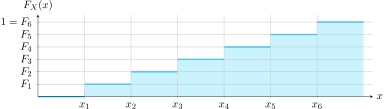

# Las funciones de distribución de una variable aleatoria

## Importancia de las funciones de distribución de una variable aleatoria

- Las funciones de distribución y de densidad de una variable aleatoria son **descripciones completas** de su *modelo probabilístico*.
- Es la generalización de la **asignación de probabilidades** a todos los posibles resultados del experimento, que ahora están mapeados en la recta real y por eso podemos crear una **función** sobre ellos.

!!! note ""
    La más famosa de las funciones de probabilidad es la *normal* (o *gaussiana*), que describe la noción de que las probabilidades de ocurrencia de un evento están concentradas alrededor de un valor central.

## La función de probabilidad acumulativa, $F_X(x)$

La premisa de la función de probabilidad acumulativa es que, por definición, $F_X(x)$ representa “la probabilidad de que el resultado del experimento sea un valor menor a $x$”. Conforme $x$ aumenta se “acumula” toda la probabilidad anterior (pues está contenida dentro del nuevo intervalo), y de ahí su nombre.

  
La figura anterior son los casos acumulados de Covid-19 en los primeros 40 días de contagio en Costa Rica, modelados con la curva sigmoidal tipo Gompertz, que es un caso especial de la curva logística y utilizado en crecimiento de poblaciones. Es un ejemplo de función *acumulativa* pero no de *probabilidad*. Datos y modelado del profesor Víctor Granados.

### Definición

Si la probabilidad $P\{X \le x\}$ es la probabilidad del evento $\{X \le x\}$, entonces a la función de $x$

\[
\boxed{F_{X}(x) = P(X \le x)}
\]

!!! tip "Función de distribución de probabilidad acumulativa"
    se le llama *función de distribución de probabilidad acumulativa* de la variable aleatoria $X$. El argumento $x$ es cualquier número real entre $-\infty$ y $\infty$.

  
*Visualización de $\{X \le x\}$ en la recta real.*

!!! note "Probabilidad acumulativa"
    A menudo llamada simplemente **funcion acumulativa de X**. En inglés llamada *Cumulative Distribution Function, CDF*

---

### Visualización

En una función acumulativa de probabilidad de una variable aleatoria \(X\) particular, los valores \(x_1 = 4\) y \(F_X(4) = 0{,}6811\) se interpretan como que hay un **68,11 %** de probabilidad de que el valor de \(X\) esté por debajo de 4, es decir:

\[
P(X < 4) = 0{,}6811
\]

---

## Propiedades de la función acumulativa \(F_X(x)\)

La función de distribución de probabilidad acumulativa presenta las siguientes propiedades:

1. La probabilidad de que \(X\) tenga un valor menor a \(-\infty\) es cero:

    \[
   \boxed{F_{X}(-\infty) = 0}
   \]

    Esto tiene relación con el hecho conocido de que \(P(\complement S) = 0\).

2. La probabilidad de que \(X\) tenga un valor menor a \(+\infty\) (dentro de la recta real) es uno:

    \[
   \boxed{F_{X}(\infty) = 1}
   \]

    Esto tiene relación con el hecho conocido de que \(P(S) = 1\).

3. \(F_{X}(x) = P(X < x)\) es una probabilidad por sí misma, con valores acotados según el primer y segundo axioma de la probabilidad:

    \[
   \boxed{0 \leq F_{X}(x) \leq 1}
   \]

    Esto tiene relación directa con las dos propiedades anteriores.

4. \(F_{X}(x)\) es una función no decreciente de \(x\):

    \[
   \boxed{F_{X}(x_1) \leq F_{X}(x_2) \quad \text{si} \quad x_1 < x_2}
   \]

    Esto es claro por el hecho de que la función es “acumulativa”.

5. La probabilidad de que \(X\) tenga valores más grandes que algún número \(x_1\) pero que no exceda otro número \(x_2\), es igual a la diferencia en \(F_X(x)\) evaluada en tales puntos:

    \[
   \boxed{P(x_1 < X \leq x_2) = F_{X}(x_2) - F_{X}(x_1)}
   \]

    Esta propiedad permite hacer cálculos numéricos de probabilidades a partir de la CDF.

6. \(F_X(x)\) tiene continuidad por la derecha:

    \[
   \boxed{F_{X}(x^{+}) = F_{X}(x)}
   \]

    Donde \(x^{+}\) significa \(x + \varepsilon\), y \(\varepsilon > 0\) es infinitesimalmente pequeño; es decir, \(\varepsilon \rightarrow 0\). Esto es útil con variables aleatorias discretas.

---

## Función de distribución acumulativa discreta

### Definición

Si $X$ es una variable aleatoria discreta, $F_{X}(x)$ tiene forma escalonada. La amplitud de un escalón igualará la probabilidad de ocurrencia del valor de $X$ donde el escalón ocurre.

  
*Función de distribución acumulativa discreta, con $F_X(x_i)=F_i$.*
---

Si los valores de $X$ se denotan $x_i$ , $F_X(x)$ se escribe como:

\[
\boxed{F_{X}(x) = \sum_{i = 1}^{N}P\text{{X = $x_i$}}\,u(x - x_i)}
\]

Donde ${u(·)}$ es la función escalón unitario. Si se define $P(x_i)=P(X=x_i)$, puede escribirse más brevemente:

\[
\boxed{F_{X}(x) = \sum_{i=1}^{N}P(x_i)\,u(x - x_i)}
\]

---

:material-pencil-box: **EJEMPLO**

!!! example "Ejemplo con un dado"
    Un experimento consiste en lanzar un dado. EHay seis resultados posibles: las caras del dado, identificadas como $S = \{1, 2, 3, 4, 5, 6\}$
    Todas tienen igual probabilidad de ocurrencia. Se define una variable aleatoria $Y(s)$ que mapea cada cara a un número en la recta real igual a la cantidad de puntos en la cara del dado.

    

    Dado que todas las caras son igualmente probables,

      $P(x_i) = P(X = x_i) = \tfrac{1}{6},\quad i=1,\dots,6.$

    | $i$      | 1   | 2   | 3   | 4   | 5   | 6   |
    |---------:|:---:|:---:|:---:|:---:|:---:|:---:|
    | $x_i$    | 1   | 2   | 3   | 4   | 5   | 6   |
    | $P(x_i)$ | 1/6 | 1/6 | 1/6 | 1/6 | 1/6 | 1/6 |

    Y así su función de distribución es

    $F_{X}(x) = \sum_{i=1}^{N}P(x_i)\,u(x - x_i)  = \sum_{i=1}^{6}\tfrac{1}{6}\,u(x - x_i)$

    

    

!!! note ""

    **Pregunta:** ¿Cuál es la probabilidad $P(1 < X \le 5)$?

    $P(1 < X \le 5) = F_X(x_2) - F_X(x_1)
                      = F_X(5) - F_X(1)
                      = \tfrac{5}{6} - \tfrac{1}{6}
                      = \tfrac{4}{6}$
