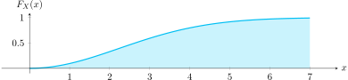

!!! note "Introducción"

    La función de densidad de probabilidad describe cómo se distribuye la probabilidad a lo largo de la recta real. Es la base para numerosos cálculos numéricos en el análisis probabilístico.

# Función de densidad de probabilidad \( f_X \)

## Función de densidad continua

!!! important "Definición"

    La función de densidad \( f_X \) es la derivada de la función de distribución acumulativa:

    $$
    f_X = \frac{\mathrm{d}F_X}{\mathrm{d}x}
    $$

    También se le llama **PDF** (*Probability Density Function*).

### Visualización

  

## Función de densidad discreta

!!! important "Definición"

    Para una variable discreta:

    $$
    \begin{aligned}
    f_X &= \frac{\mathrm{d}}{\mathrm{d}x} \sum_{i=1}^{N}P(x_i)u(x - x_i) \\\\
    f_X &= \sum_{i=1}^{N}P(x_i)\delta(x - x_i)
    \end{aligned}
    $$

    También se le llama **PMF** (*Probability Mass Function*).

### Visualización

  

## Propiedades de \( f_X \)

1. \( f_X \geq 0 \) para todo \( x \)
2. Área total unitaria:
   $$
   \int_{-\infty}^{\infty} f_X\,\mathrm{d}x = 1
   $$
3. Probabilidad en un intervalo:
   $$
   P(x_1 < X \leq x_2) = \int_{x_1}^{x_2} f_X\,\mathrm{d}x
   $$
4. La función acumulativa se obtiene de la densidad:
   $$
   F_X = \int_{-\infty}^{x} f_X(\xi)\,\mathrm{d}\xi
   $$

