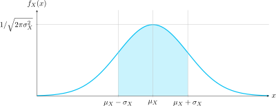
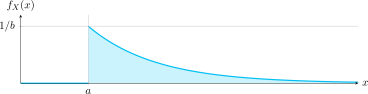

### Presentación

[4 - Variables aleatorias](https://www.overleaf.com/read/tqgnrvbdpdvr#f90d57)

### Secciones

# Algunas funciones de distribución probabilística de aplicación común

----
Elaborado por Evelyn Feng Wu B82870

----

## Función de densidad gaussiana o normal

### Definición

La función gaussiana tiene la *forma* general de la función:

$$
f(x) = e^{-x^2}
$$

En particular, una variable aleatoria \( X \) es normal si su función de densidad es:

$$
f_X(x) = \frac{1}{\sqrt{2\pi\sigma_X^2}} \exp\left[ -\frac{(x - \mu_X)^2}{2\sigma_X^2} \right]    \quad  (6)       
$$ 

donde $\sigma_X > 0$ y $-\infty < \mu_X < \infty$ son constantes reales, conocidas como desviación estándar y media, respectivamente.
La diferencia entre las ecuaciones anteriores es que (6) aplica la normalización (el área bajo la curva es 1)
y el desplazamiento en el eje real (¡y por eso se ve tan complicada, pero la forma es la misma!).

### Función de densidad normal I - Gráfica (la "campana" gaussiana)

**Figura**: Función de distribución de probabilidad gaussiana I

- Cumple con las propiedades $f_X(x) \geq 0$ para todo $x$, y $\int_{-\infty}^{\infty} f_X(x) \, dx = 1$.
- Su valor máximo $\frac{1}{\sqrt{2\pi\sigma_X^2}}$ ocurre en $x = \mu_X$.
- Su dispersión (es decir, la forma particular en que se distribuyen los valores de la función) alrededor de $x = \mu_X$ está relacionado con $\sigma_X$.
- La función disminuye a 0.607 veces su máximo en $x = \mu_X + \sigma_X$ y en $x = \mu_X - \sigma_X$.

### Función de densidad normal II - Gráfica (la "campana" gaussiana)

**Figura**: Función de distribución de probabilidad gaussiana II

### Ejemplos de aplicación

Como la variable gaussiana es tan común, tiene una notación especial. Al decir:

$X : \mathcal{N}(\mu,\sigma^2) \quad \text{o} \quad X \sim \mathcal{N}(\mu,\sigma^2)$

significa que la variable aleatoria \( X \) tiene una distribución gaussiana o "normal" con media $\mu$ y varianza $\sigma_X^2$ (la desviación estándar es $\sigma_X$).

 **¿Dónde aparece?**
En el ruido térmico que afecta a la electrónica y en cierto tipo de interferencia que posa un canal inalámbrico sobre las comunicaciones. Además de innumerables otros fenómenos físicos, económicos y sociales, algo que quizá se explicará con el **teorema del límite central**, más adelante.

## Función de densidad uniforme

### Definición

Las funciones de densidad probabilística y acumulativa uniforme están definidas por:

$$
f_X(x) =
\begin{cases}
\displaystyle \frac{1}{b - a} & \text{si } a \leq x \leq b \\
0 & \text{para otros valores de } x
\end{cases}
$$

$$
F_X(x) =
\begin{cases}
0 & x < a \\
\displaystyle \frac{x - a}{b - a} & a \leq x < b \\
1 & x \geq b
\end{cases}
$$

para constantes reales $-\infty < a < \infty$ y $b > a$.

### Gráfica de densidad uniforme

**Figura**: Función de densidad uniforme

### Ejemplos de aplicación
 **¿Dónde aparece?**  
Cuando no se tiene mayor información sobre el comportamiento de la variable aleatoria puede asumirse un comportamiento uniforme.  
**Ejemplo** (un mal ejemplo): una llamada de oficina sucederá entre las 8:00 am y las 5:00 pm con igual probabilidad.

---

## Función de densidad exponencial

### Definición

Las funciones de distribución y de densidad exponencial son:

$$
f_X(x) =
\begin{cases}
\frac{1}{b} \exp\left[ -\left( \frac{x - a}{b} \right) \right] & x > a \\
0 & x < a
\end{cases}
$$

$$
F_X(x) =
\begin{cases}
1 - \exp\left[ -\left( \frac{x - a}{b} \right) \right] & x > a \\
0 & x < a
\end{cases}
$$

para números reales $-\infty < a < \infty$ y $b > 0$. 
También es usual la notación:

$$
f_X(x) =
\begin{cases}
\lambda e^{-\lambda x} & x > 0 \\
0 & x < 0
\end{cases}
$$
### Gráfica de la función de densidad exponencial

**Figura**: Función de densidad de probabilidad exponencial

### Ejemplos de aplicación
 **¿Dónde aparece?**  
Ocurre en problemas de tiempo de espera o en el cálculo de la vida útil de dispositivos.

---

## Función de densidad de Rayleigh

### Definición

Las funciones de distribución y de densidad Rayleigh son:

$$
f_X(x) =
\begin{cases}
\frac{2}{b}(x - a)\exp\left[ -\left( \frac{(x-a)^2}{b} \right) \right] & x \geq a \\
0 & x < a
\end{cases}
$$

$$
F_X(x) =
\begin{cases}
1 - \exp\left[ -\left( \frac{(x-a)^2}{b} \right) \right] & x \geq a \\
0 & x < a
\end{cases}
$$

para constantes reales $-\infty < a < \infty$ y $b > 0$. 

### Gráfica de la función de densidad de Rayleigh

**Figura**: Función de densidad de probabilidad de Rayleigh

### Ejemplos de aplicación

 **¿Dónde aparece?**
Aparece en errores de aterrizaje de cohetes, fluctuaciones aleatorias de la envolvente de ciertas formas de onda, la distribución radial de los errores en un tablero de dardos, o los tiempos de llegada de las señales de múltiples trayectorias en transmisión inalámbrica.

---

## Función de densidad binomial

### Definición

Sea $0 < p < 1$ y $N = 1, 2, \dots$, entonces la función 

$$
f_X(x) = \sum_{k=0}^{N} \binom{N}{k} p^k (1 - p)^{N - k} \delta(x - k)
$$

se llama la función de densidad binomial. La cantidad $\binom{N}{k}$ es el coeficiente binomial

$$
\binom{N}{k} = \frac{N!}{k!(N - k)!}
$$

### Gráfica de la función de densidad binomial

**Figura**: Función de densidad de probabilidad discreta binomial

### Ejemplos de aplicación

 **¿Dónde aparece?**
Modela la posibilidad de superar un umbral aceptable dada una tasa de ``errores'' (u ocurrencias de un evento). Se usa en análisis de riesgo, estimación de personal necesario según demanda de servicios, o número de defectos en un lote de producción.

---

## Función de densidad de Poisson

### Definición

La variable aleatoria de Poisson $X$ tiene una densidad y distribución dadas por

$$
f_X(x) = e^{-b} \sum_{k = 0}^{\infty} \frac{b^k}{k!} \delta(x - k)
$$

$$
F_X(x) = e^{-b} \sum_{k = 0}^{\infty} \frac{b^k}{k!} u(x - k)
$$

donde $b > 0$ es una constante real. Cuando son graficadas, estas funciones parecen similares a la variable aleatoria binomial. De hecho, si $N \rightarrow \infty$ y $p \rightarrow 0$ para el caso binomial de tal manera que $Np = b$, una constante, entonces resulta la función de densidad de Poisson. 

### Gráfica de Poisson

**Figura**: Función de densidad de probabilidad de Poisson

### Ejemplos de aplicación

 **¿Dónde aparece?**
Se utiliza para describir eventos esporádicos en una población grande, como la mutación de una célula, o los errores de bits en una transmisión de datos.

---

## ¡Y hay muchas (muchas) distribuciones más!

|                         |                       |                      |                      |
|-------------------------|-----------------------|----------------------|----------------------|
| Bernoulli               | Beta                  | Gamma                | Z de Fisher          |
| Rademacher              | Coseno elevado        | Erlang               | Behrens–Fisher       |
| Beta-binomial           | Irwin-Hall            | Gamma-Gompertz       | Cauchy               |
| Degenerada en x₀        | Kent                  | Gumbel tipo-2        | Chernoff             |
| Hipergeométrica         | Kumaraswamy           | Lévy                 | Lévy                 |
| Benford                | Logit-normal          | Log-Cauchy           | Estable geométrica   |
| Binomial negativa       | Normal truncada       | Log-gamma            | Fisher–Tippett       |
| Geométrica              | Triangular            | Log-normal           | Gumbel               |
| Boltzmann               | U-cuadrática          | Mittag-Leffler       | Holtsmark            |
| Gibbs                   | Von Mises-Fisher      | Nakagami             | Landau               |
| Elíptica asimétrica     | Wigner                | Wald                 | Linnik               |
| Fractal parabólica      | Beta prima            | Pareto               | Map-Airy             |
| Polya-Eggenberger       | Birnbaum              | Tipo III de Pearson  | Dirichlet            |
| Skellam                 | Chi, χ                | Bi-exponencial       | Ewens                |
| Yule–Simon              | χ²                    | Bi-Weibull           | Balding–Nichols      |
| Zeta                    | Dagum                 | Rice                 | Multivariante        |
| Zipf–Mandelbrot         | F (mi favorita)       | T² de Hotelling      | ...                  |
| Arcoseno                | Fréchet               | Rosin-Rammler        |                      |

---

## ¿Y aplicaciones? Muchas, también

- Para describir el número de eventos que ocurren en un periodo de tiempo
- Para describir el número de intentos necesarios hasta conseguir el primer acierto
- Para predecir tiempos de espera en sistemas telefónicos
- Para estimar la esperanza de vida poblacional
- Para modelar procesos farmacocinéticos (relacionados con la acción de los medicamentos en el cuerpo)
- Para describir la distribución de tamaños de determinadas partículas
- Para análisis genético de poblaciones
- Para pronosticar fenómenos atmosféricos
- Para pronosticar movimientos de la bolsa de valores
- Para calcular los recursos necesarios en una epidemia
- ...

---

## Videos y referencias en internet

- **Variables aleatorias discretas y continuas | Estadística UNED**
  *Frísica y Mates*, https://youtu.be/n0T_HcJ7oak
- **Understanding Random Variables - Probability Distributions 1**
- *Dr Nic’s Maths and Stats*, https://youtu.be/lHCpYeFvTs0
- **The Galton Board** (una visualización interesante de cómo aparece la distribución normal en experimentos aleatorios)  
  *PhysicsFun*, https://youtu.be/Vo9Esp1yaC8
- **[Name of the distribution]**
  *Wikipedia*, https://en.wikipedia.org/wiki/Name_of_the_distribution
- **Why “probability of 0” does not mean “impossible”**
  *3Blue1Brown*, https://youtu.be/ZA4JkHKZM50
