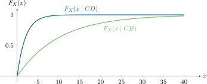

## Casos especiales de la función acumulativa condicional

Sea el evento \(B = \{X \le b\}\) (una semirrecta), donde \(b\) es algún número real \(-\infty < b < \infty\). Entonces,

$$
\begin{aligned}
F_X(x \mid X \le b)
&\;\triangleq\; P\bigl(X \le x \mid X \le b\bigr) \\[6pt]
&= \frac{P\bigl(\{X \le x\} \cap \{X \le b\}\bigr)}{P(X \le b)}
\end{aligned}
$$

donde \(P(X \le b)\neq 0\).

Dos situaciones pueden considerarse, una es donde \(X \ge b\) y la otra donde \(X < b\).

**Si \(b \le x\)**, el evento \(B = \{X \le b\}\) es un subconjunto de \(A = \{X \le x\}\), de modo que \(\{X \le x\}\,\cap\,\{X \le b\} = \{X \le b\}\).

Luego,

$$
\begin{aligned}
F_X(x \mid X \le b)
&= \frac{P(\{X \le x\}\cap\{X \le b\})}{P(X \le b)} \\[4pt]
&= \frac{P(X \le b)}{P(X \le b)} = 1
\end{aligned}
$$

para \(x \ge b\).

**Si \(b > x\)** el evento \(A = \{X \le x\}\) es un subconjunto de \(B = \{X \le b\}\), de modo que \( \{X \le x\}\,\cap\,\{X \le b\} = \{X \le x\} \).

Entonces,

$$
\begin{aligned}
F_X(x \mid X \le b)
&= \frac{P(\{X \le x\}\cap\{X \le b\})}{P(X \le b)} \\[4pt]
&= \frac{F_X(x)}{F_X(b)}
\end{aligned}
$$

para \(x < b\).

$$
F_X(x \mid X \le b) =
\begin{cases}
\displaystyle \frac{F_X(x)}{F_X(b)} & x < b\\[8pt]
1 & x \ge b
\end{cases}
$$

cuando $B = \{X \leq b\}$, donde $b$ es algún número real $-\infty < b < \infty$.

---

### Ejemplo de la caída de un paracaidista

La distancia de yerro radial de aterrizajes por paracaídas medida desde el centro del blanco, es una variable aleatoria Rayleigh con \(b = 800~\mathrm{m}^2\) y \(a = 0\). El blanco es un círculo de radio 50 metros con un ojo de buey de radio 10 metros. Encuéntrese la probabilidad de que un paracaidista acierte en el ojo del buey si el aterrizaje es dentro del blanco.

$$
F_{X}(x) \;=\; \biggl[1 - \exp\!\Bigl(-\tfrac{x^2}{800}\Bigr)\biggr]\,u(x)
$$

La probabilidad \(P(\text{dar en el ojo de buey}\mid \text{aterrizaje en el blanco})\) es:

$$
\begin{aligned}
P(\{X \le 10\}\mid \{X \le 50\})
&= \frac{P(\{X \le 10\} \cap \{X \le 50\})}{P(\{X \le 50\})}
= \frac{P(\{X\le 10\})}{P(\{X\le 50\})} \\[6pt]
&= \frac{F_{X}(10)}{F_{X}(50)}
= \frac{1 - e^{-100/800}}{1 - e^{-2500/800}}
= 0.1229
\end{aligned}
$$

La precisión del paracaidista es tal que cerca de un **12.29 %** de aterrizajes que dan en el blanco serán dentro del ojo de buey.

---

### La función acumulativa de probabilidad total

Cuando existe una partición `[^1]` \(\{ A_i \}\) de la cual depende otro evento \(B = \{ X \le x \}\), se puede crear una probabilidad total condicional de la forma en que se hizo anteriormente.

Ahora,

$$
F_X(x) \;=\; \sum_{i=1}^{N} F_X(x \mid A_i)\,P(A_i)
$$

Esta ecuación describe a \(F_X(x)\) como la _suma ponderada_ de funciones de distribución condicionales.

`[^1]`: Una partición es exhaustiva y sus conjuntos son mutuamente excluyentes.

---
### Ejemplo de chips de memoria defectuosos (Probabilidad total condicional)

En la manufactura automatizada de chips de memoria de computadoras, la compañía Evil Corp. produce y vende un chip defectuoso por cada cinco chips buenos. Los chips defectuosos (CD) tienen un tiempo de fallo X que obedece la CDF  
 
  \(\displaystyle F_X(x \mid CD) = \bigl(1 - e^{-x/2}\bigr)\,u(x)\) (\(x\) en meses)

mientras que el tiempo de fallo de los chips buenos (CB) sigue la función de distribución de probabilidad acumulativa

  \(\displaystyle F_X(x \mid CB) = \bigl(1 - e^{-x/10}\bigr)\,u(x)\) (\(x\) en meses)

 

[Figura](images/5_func_acum_chips.svg): La función acumulativa de \(X\), tiempo de fallo, demuestra que, cuando el chip es defectuoso, \(F_X(x \mid CD)\approx 1\) prácticamente antes de los 10 meses, mientras que, cuando está bueno, la probabilidad casi segura de fallo se alcanza alrededor de la semana 40: \(F_X(40 \mid CB)\approx 1\).

Visualmente, los chips malos son irreconocibles de entre los buenos. Un chip es comprado. ¿Cuál es la probabilidad de que el chip fallará antes de seis meses de uso?

La distribución de probabilidad *incondicional* para el chip es

$$
F_X(x) \;=\; F_X(x \mid CB)\,P(CB)\;+\;F_X(x \mid CD)\,P(CD)
$$

donde \(P(CB)\) y \(P(CD)\) son las probabilidades de seleccionar un chip bueno y uno malo, respectivamente. Entonces

$$
\begin{aligned}
F_X(6) &= \bigl(1 - e^{-0.6}\bigr)\,\frac{5}{6}\;+\;\bigl(1 - e^{-3}\bigr)\,\frac{1}> >{6} \\
       &= 0.158 \;+\; 0.376 \;=\; 0.534
\end{aligned}
$$

 

[Figura](images/5_func_acum_chips_2.svg): Función acumulativa de $X$, $F_X(x)$ junto al caso de chips defectuosos, $F_X(x \mid CD)$, y de chips buenos, $F_X(x \mid CB)$. Como hay más chips buenos que defectuosos, la función acumulativa total se acerca más a la de los chips buenos.
