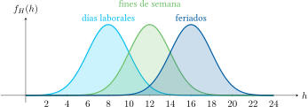

# Función de densidad condicional, $f_{X}(x \mid B)$

!!! Introducción
    La función de densidad condicional es una nueva función de densidad, de propiedades idénticas, que asume la existencia de un evento condicionante. En la práctica, al igual que la función acumulativa, puede servir para modelar los distintos escenarios ante diferentes cursos de acción (decisiones, sucesos, otros eventos aleatorios, etc.).

!!! tip "Función de densidad condicional"
    De manera similar a la función de densidad ordidnaria (o incondicional):

    \begin{equation}
    f_{X}(x \mid B) = \frac{\mathsf{d}}{\mathsf{d}x}F_{X}(x \mid B)
    \end{equation}

Si $F_{X}(x \mid B)$ contiene discontinuidades tipo escalón, como cuando $X$ es una variable aleatoria discreta o mixta, habrá funciones impulso en $f_{X}(x \mid B)$ a causa de las derivadas en las discontinuidades.

## Propiedades

Todas las propiedades de las funciones de densidad ordinarias se aplican a $f_{X}(x \mid B)$:

- Siempre positivo:  

    \begin{equation}
    f_{X}(x \mid B) \geq 0
    \end{equation}

- El área bajo la curva es unitaria:  

    \begin{equation}
    \int_{-\infty}^{\infty}f_{X}(x \mid B)~\mathrm{d}x = 1
    \end{equation}

- Probabilidad en un intervalo:  

    \begin{equation}
    P\{x_1 < X \leq x_2 \mid B\} = \int_{x_1}^{x_2}f_{X}(x \mid B)~\mathrm{d}x
    \end{equation}

- Función acumulativa a partir de función de densidad:  

    \begin{equation}
    F_{X}(x \mid B) = \int_{-\infty}^{x}f_{X}(v \mid B)~\mathrm{d}v
    \end{equation}

---

:material-pencil-box: **EJEMPLO**

!!! example "Ejemplo del primer cliente de una tienda"
    Sea $H$ una variable aleatoria que representa la hora a la que llega el primer cliente a un comercio particular. Su distribución cambia según sea el día $D$ de la semana. La función $f_H(h \mid D)$ es una distribución normal con los siguientes parámetros:

    \begin{equation}
        f_H(h \mid D) = \frac{1}{\sqrt{2\pi\sigma^2}} e^{- \frac{\left(h - \mu \right)^2}{2\sigma^2}} \quad \text{con}
        \begin{cases}
            \mu = 8, \sigma^2 = 4 & \text{si } D = \text{días laborales} \\
            \mu = 12, \sigma^2 = 4 & \text{si } D = \text{fines de semana} \\
            \mu = 16, \sigma^2 = 4 & \text{si } D = \text{feriados} \\
        \end{cases}
    \end{equation}

!!! note ""
    Este ejemplo muestra cómo una misma variable aleatoria puede tener distintas funciones de densidad dependiendo del evento condicionante.

---
