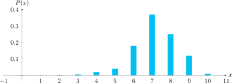
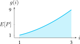

!!! note "Introducción"

    El valor esperado y los "momentos" (su generalización) permiten caracterizar numéricamente el comportamiento o las tendencias de una variable aleatoria.

# Valor esperado de una variable aleatoria, $E[X]$

El valor esperado de una variable aleatoria es uno de los resultados más importantes y más frecuentemente utilizados. Ya lo conocíamos en su forma discreta como "promedio".

!!! example "Ejemplo de la escala de Apgar"

    Los bebés son evaluados en la *escala de Apgar*, creada por Virginia Apgar, quien le puso el retrónimo *Appearance, Pulse, Grimace, Activity, Respiration*.

    Sea $X$ el puntaje de Apgar de un niño seleccionado aleatoriamente en cierto hospital, y suponga que la función de masa de probabilidad (PMF) $P(X)$ es:

    | x     | 0    | 1    | 2    | 3    | 4    | 5    | 6    | 7    | 8    | 9    | 10   |
    |-------|------|------|------|------|------|------|------|------|------|------|------|
    | P(x) | 0.002| 0.001| 0.002| 0.005| 0.02 | 0.04 | 0.18 | 0.37 | 0.25 | 0.12 | 0.01 |

    **¿Cuál valor de $X$ esperaríamos si elegimos un niño(a) al azar?**

!!! important "Definición"

    El *valor esperado* es un operador denotado $E[\cdot]$, también conocido como esperanza matemática, valor medio, media o promedio estadístico.

> Un promedio puede verse como "el número más cercano a todos los números del conjunto, en el sentido de que la suma de las distancias desde él a todos los puntos es la más pequeña". Similar a un *centro de gravedad*.

## Valor esperado de una variable aleatoria continua

!!! tip "Valor esperado de una variable aleatoria continua"

    $$E[X] = \int_{-\infty}^{\infty} x f_X(x)\, \mathrm{d}x \triangleq \overline{X}$$

Este valor se obtiene utilizando la función de densidad $f_X(x)$, que asigna un peso a cada valor infinitesimal de $x$.

!!! example "Ejemplo: Promedio de una distribución exponencial"

    Sea $X$ una variable aleatoria exponencial con:

    $$
    f_X(x) = 
    \begin{cases} 
    \lambda e^{-\lambda x} & x \geq 0 \\
    0 & x < 0 
    \end{cases}
    $$

    ¿Cuál es su valor esperado?

    $$
    \begin{aligned}
    E[X] &= \int_{0}^{\infty} x \lambda e^{-\lambda x} \, \mathrm{d}x \\
         &= \left. -x e^{-\lambda x} \right|_{0}^{\infty} + \int_{0}^{\infty} e^{-\lambda x} \, \mathrm{d}x = \frac{1}{\lambda}
    \end{aligned}
    $$

## Valor esperado de una variable aleatoria discreta

Si $X$ es discreta con valores $x_i$ y probabilidades $P(x_i)$:

\[
E[X] = \int_{-\infty}^{\infty} x \sum_{i=1}^{N} P(x_i)\, \delta(x - x_i)\, dx
\]

\[
= \sum_{i=1}^{N} P(x_i) \int_{-\infty}^{\infty} x\, \delta(x - x_i)\, dx = \sum_{i=1}^{N} x_i P(x_i)
\]

$$E[X] = \sum_{i=1}^N x_i P(x_i)$$

!!! tip "Valor esperado de una variable aleatoria discreta"

    El valor esperado es la suma ponderada de los posibles valores:

    $$E[X] = \sum_{i=1}^N x_i P(x_i) \triangleq \overline{X}$$

## Valor esperado de una variable aleatoria simétrica

Si la función de densidad es simétrica alrededor de $x = a$, entonces:

$$E[X] = a \quad \text{si} \quad f_X(x + a) = f_X(-x + a)$$

# Valor esperado de una función, $E[g(X)]$

Para una función $g(X)$ de una variable aleatoria $X$:

!!! important "Definición"

    $$E[g(X)] = \int_{-\infty}^{\infty} g(x) f_X(x) \, \mathrm{d}x$$

Si $X$ es discreta:

!!! important "Definición"

    $$E[g(X)] = \sum_{i=1}^N g(x_i) P(x_i)$$

> En general: $E[g(X)] \neq g(E[X])$

!!! example "Ejemplo: Potencia disipada en un resistor"

    Sea $I$ una corriente con distribución uniforme entre 1 A y 3 A. Entonces:

    $$
    f_I(i) = 
    \begin{cases} 
    1/2 & 1 < i < 3 \\
    0 & \text{otro caso} 
    \end{cases}
    $$

    ¿Cuál es el valor esperado de la corriente $I$? ¿Y de la potencia $P = I^2 R$ si $R = 1\,\Omega$?

**Solución:**

- Promedio de la corriente:

\[
E[I] = \int_{1}^{3} i \cdot \frac{1}{2} \, \mathrm{d}i = \left. \frac{1}{4} i^2 \right|_1^3 = \frac{9 - 1}{4} = 2~A
\]

- Potencia disipada:

\[
E[P] = \int_{1}^{3} i^2 \cdot \frac{1}{2} \, \mathrm{d}i = \left. \frac{1}{6} i^3 \right|_1^3 = \frac{27 - 1}{6} = \frac{26}{6} \approx 4.33~W
\]

  

# Valor esperado condicional, $E[X\mid B]$

El valor esperado condicional depende de la función de densidad condicional:

!!! important "Definición"

    $$E[X \mid B] = \int_{-\infty}^{\infty} x \cdot f_X(x \mid B) \, \mathrm{d}x$$

## Caso especial: $B = \{X \leq b\}$

La densidad condicional es:

$$
f_X(x \mid X \leq b) = 
\begin{cases} 
\frac{f_X(x)}{\int_{-\infty}^{b} f_X(x) \, \mathrm{d}x} & x < b \\
0 & x \geq b 
\end{cases}
$$

Entonces:

$$
\begin{aligned}
E[X \mid X \leq b] &= \int_{-\infty}^{\infty} x \cdot \frac{f_X(x)}{\int_{-\infty}^{b} f_X(x) \, \mathrm{d}x} \, \mathrm{d}x \\
&= \frac{E[X]}{P(B)}
\end{aligned}
$$

> Este es el valor esperado de $X$ restringido al conjunto $\{X \leq b\}$.

