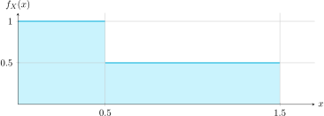

# Momentos de una variable aleatoria

## Introducción

> El valor esperado es un caso especial de una categoría más general, denominada "momentos de una variable aleatoria". Son valores que resumen o sintetizan propiedades de la variable aleatoria.

> Mientras que la función de densidad de probabilidad (PDF) es una **descripción completa** de la variable aleatoria, los momentos cuantifican ciertas propiedades como el “valor esperado”, la “dispersión”, la “inclinación” o “lo
llano” de una *va* y son una herramienta estadística
valiosa para el análisis de su comportamiento.

---

## Momentos alrededor del origen u *ordinarios*

!!! tip "Momentos ordinarios"
    La función \( g(X) = X^n \), \( n = 0, 1, 2, \ldots \), da los momentos alrededor del origen de la variable aleatoria \( X \) son:

    \[
    m_{n} = E\left[ X^{n} \right] = \int_{-\infty}^{\infty} x^{n} f_{x}(x) \, dx
    \]

**Casos especiales:**

El valor \( m_0 = 1 \) es el área de la función \( f_x(x) \), en tanto que \( m_1 = \overline{X} = E[X] \) es el valor esperado de \( X \).

---

## Momentos alrededor de la media o *centrales*

!!! tip "Momentos centrales"

    Los momentos alrededor del valor medio \( \overline{X} \) se llaman momentos centrales y se denotan por \( \mu_n \). Son el valor esperado de la función \(g(x)= (X - \overline{X})^n , n=0,1,2,\ldots\) es decir,

    \[
    \mu_n = E\left[ (X - \overline{X})^n \right] = \int_{-\infty}^{\infty} (x - \overline{X})^n f_X(x) \, dx
    \]

**Casos especiales:**

\( \mu_0 = 1 \) es el áres de \( f_x(x) \), mientras que \( \mu_1 = 0 \) 

---

## Clasificación de momentos

- **Momentos ordinarios** (alrededor del origen): \( E[X^n] \)
- **Momentos centrales**(alrededor de la media): \( E[(X - \overline{X})^n] \)
- **Momentos generalizados**(alrededor de un número cualquiera): \( E[(X - a)^n] \)
- **Momentos absolutos**(momentos alrededor del origen con los valores absolutos de la
variable aleatoria): \( E[|X|^n] \)

---

## Algunos momentos importantes 
Aparte de la media, algunos momentos particulares tienen nombres especiales y son los
más comúnmente utilizados para describir las variables aleatorias. Ellos son:

| Nombre                | Descripción                          |
|----------------------|--------------------------------------|
| **Varianza / Desviación estándar** | Medida de la *dispersión* |
| **Sesgo**             | Medida de la *inclinación*           |
| **Curtosis**          | Medida del *abultamiento*            |

---

## Valor esperado

Según la nueva definición de momentos, el valor esperado (o suma ponderada o
promedio o esperanza matemática. . . ) es \(m_1\), el primer momento ordinario

\[
m_1 = E[X] = \int_{-\infty}^{\infty} x \cdot f_X(x) \, dx
\]

---

## Varianza y desviación estándar

**Segundo momento central:**

A \( \mu_2 \) se le da el nombre *varianza* y tiene la notación \(\sigma_X^2\)

\[
\begin{aligned}
\sigma_X^2 &= E[(X - \overline{X})^2] \\
           &= \int_{-\infty}^{\infty} (x - \overline{X})^2 f_X(x) \, dx \\
           &= E[X^2-2X\overline{X}+\overline{X}^2]\\
           &= E[X^2] -2(E[X])^2+ \overline{X}^2\\
           &= E[X^2] - \overline{X}^2 \\
           &= m_2 - m_1^2
\end{aligned}
\]

La raíz cuadrada positiva de la varianza, \(\sigma_x\) , se denomina la **desviación estándar** de X.
Es una medida de la dispersión de la función \(f_{x} (x)\) alrededor de la media.

**Desviación estándar:** \( \sigma_X = \sqrt{\sigma_X^2} \)

---

## Inclinación (*skewness*)

**Tercer momento central:**

\[
\mu_3 = E[(X - \overline{X})^3]
\]

es una medida de la asimetría de \(f_X (x)\) alrededor de su valor medio.
Se le llama la inclinación (*skewness*) de la función de densidad.

*  Si una densidad es simétrica alrededor de \(x = \overline{X}, \) tiene cero inclinación, de hecho, \(\sigma_n = 0\) para valores impares de n.
* El tercer momento central normalizado \( \mu_3/ \sigma_x^3\) es conocido como el *coeficiente de inclinación* de la función de densidad,

\[
S_X = E\left[ \left( \frac{X - m_1}{\sigma_X} \right)^3 \right]
\]

que es un número adimensional que describe la inclinación o el sesgo del PDF. Si \(S_X\)
es 0, la PDF es simétrica, y si es negativo o positivo tiende a la izquierda o la
derecha, respectivamente.

## Kurtosis

### Momento central de orden cuatro

La **kurtosis** $\kappa_X$ se define como:

$$
\kappa_X = E \left[ \left( \frac{X - m_1}{\sigma_X} \right)^4 \right] - 3
$$

Y es un número adimensional descriptor del **abultamiento** de la variable aleatoria \(\ldots \)

- \(\ldots \) si está *"achatada"* ($\kappa_X < 0$) → *platicúrtica*
- \(\ldots \) o es *prominente* ($\kappa_X > 0$) → *leptocúrtica*

La sustracción del 3 es una comparación con la distribución normal (que es siempre $\kappa_X = 3$) la cual se diría no es ni achatada ni prominente.

---

:material-pencil-box: **Ejemplo para un $f_X(x)$ de los primeros cuatro momentos I**

!!! example ""
    

    Para el siguiente PDF, $f_X(x)$, determine los primeros cuatro momentos de la variable aleatoria.

    ¿Primeras impresiones sobre la media, la dispersión, la inclinación y la kurtosis?

---

:material-pencil-box: **EJEMPLO II**

!!! example ""
    

    $$
    f_X(x) =
    \begin{cases}
    1 		& 0 \leq x < 0.5 \\
    0.5 	& 0.5 \leq x < 1.5 \\
    0		& \text{en otro caso}
    \end{cases}
    $$

    **La media** momento ordinario de orden uno,

    $$
    m_1 = E[X] = \int_{0}^{0.5} x \cdot 1\,dx + \int_{0.5}^{1.5} x \cdot 0.5\,dx = 0.625
    $$

---

---

:material-pencil-box: **EJEMPLO III**

!!! example ""
    **La varianza** momento central de orden dos, 

    $$
    \begin{aligned}
    \sigma_X^2 &= E[(X - m_1)^2] \\
    &= E[X^2] - m_1^2 \\
    &= \int_{0}^{0.5} x^2 \cdot 1\,dx + \int_{0.5}^{1.5} x^2 \cdot 0.5\,dx - 0.625^2 \\
    &= 0.1927
    \end{aligned}
    $$

    El significado de este número usualmente se aprecia en relación con otras
    densidades probabilísticas (¿qué tan disperso es uno en comparación con
    el otro?), y puede tener algún significado importante para el experimento
    (la precisión de fabricación, por ejemplo).

---

:material-pencil-box: **EJEMPLO IV**

!!! example ""
    **La inclinación (skewness)** momento central de orden tres,

    $$
    \begin{aligned}
    S_X &=  \left[ \left( \frac{X - m_1}{\sigma_X} \right)^3 \right] \\
    &= \int_{0}^{0.5} \left( \frac{x - 0.625}{0.439} \right)^3 \cdot 1\,dx \\
    &\quad + \int_{0.5}^{1.5} \left( \frac{x - 0.625}{0.439} \right)^3 \cdot 0.5\,dx \\
    &= 0.416
    \end{aligned}
    $$

    Esto implica que está sesgada a la derecha.
    

---

:material-pencil-box: **EJEMPLO V**

!!! example ""
    **La kurtosis** momento central de orden cuatro,

    $$
    \begin{aligned}
    \kappa_X &=  \left[ \left( \frac{X - m_1}{\sigma_X} \right)^4 \right]  \\
    &= \int_{0}^{0.5} \left( \frac{x - 0.625}{0.439} \right)^4 \cdot 1\,dx \\
    &\quad + \int_{0.5}^{1.5} \left( \frac{x - 0.625}{0.439} \right)^4 \cdot 0.5\,dx - 3 \\
    &= -0.105
    \end{aligned}
    $$

    lo que implica que tiene una cima achatada.

---

## Ejemplos de momentos para distribuciones usuales I
<!--
|  |  |  |
|:---------:|:---------:|:---------:|
| Uniforme  | Exponencial | Rayleigh |-->

<!-- En la presentanción aqui van 3 imagenes pero no están agregadas en la carpeta images, agregué las que se usan de ejemplos en otro lugar de la presentación  -->

| **Característica** | **Uniforme**                         | **Exponencial**              | **Rayleigh**                                              |
|--------------------|--------------------------------------|------------------------------|-----------------------------------------------------------|
| **PDF**            | $\frac{1}{b - a}$                    | $\lambda e^{-\lambda x}$     | $\frac{x}{\sigma^2} e^{-x^2 / (2\sigma^2)}$              |
| **Media**          | $\frac{1}{2}(a + b)$                 | $\lambda^{-1}$               | $\sigma \sqrt{\frac{\pi}{2}}$                            |
| **Varianza**       | $\frac{1}{12}(b - a)^2$              | $\lambda^{-2}$               | $\frac{4 - \pi}{2} \sigma^2$                             |
| **Inclinación**    | $0$                                  | $2$                          | $\frac{2\sqrt{\pi}(\pi - 3)}{(4 - \pi)^{3/2}} \approx 0.63$ |
| **Kurtosis**       | $-\frac{6}{5}$                       | $6$                          | $-\frac{6\pi^2 - 24\pi + 16}{(4 - \pi)^2} \approx 0.24$   |

---

# Videos y referencias en internet
-**The Expected Value and Variance of Discrete Random Variables**

jbstatistics, [https://youtu.be/Vyk8HQOckIE](https://youtu.be/Vyk8HQOckIE)
