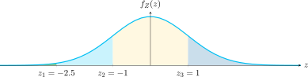
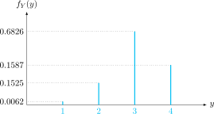

### Presentación

[7 - Funciones que dan momentos](https://www.overleaf.com/read/cgwskrxfpkps#713512)

### Presentación

[7 - Funciones que dan momentos](https://www.overleaf.com/read/cgwskrxfpkps#713512)
---

---

# Ejemplo de determinación de la función característica I

Se define una variable aleatoria discreta $Y$ con la función de densidad probabilística

$$
\begin{aligned}
  f_{Y}(y) = & P\{ X \leq x_{1} \}\delta(y-1) \\ 
  & + P\{ x_{1} < X \leq x_{2} \} \delta(y-2) \\ 
  & + P\{ x_{2} < X \leq x_{3} \}\delta(y-3) \\ 
  & + P\{ x_{3} < X < \infty \}\delta(y-4)    
\end{aligned}
$$ 

*donde $X$ es una variable aleatoria gaussiana de media 50 y desviación estándar $\sigma = 10$, con $x_{1} = 25$; $x_{2} = 40$ y $x_{3} = 60$.*

1. Graficar $\displaystyle f_{Y}(y)$ utilizando los valores de probabilidades.  

2. Calcular la función característica de la variable aleatoria $Y$.  

3. Calcular $\displaystyle E[Y^2]$ y la varianza.  

---
# Ejemplo de determinación de la función característica II

**Parte 1:** Graficar $f_{Y}(y)$ utilizando los valores correspondientes de probabilidades. 

Para darle valores a la función de densidad $f_Y(y)$ es necesario normalizar $Z$ y calcular (con tabla o programa de cómputo):

$$
Z = \frac{X - 50}{10}
$$

*Figura 1: Distribución Gaussiana normalizada (representación gráfica)*

---

# Ejemplo de determinación de la función característica III

- $P\{ X \leq 25 \} = F_X(25) = F_Z(-2.50) = 1 - F_Z(2.50) = 1 - 0.9938 = \mathbf{0.0062}$
- $P\{ 25 < X \leq 40 \} = F_X(40) - F_X(25) = \mathbf{0.1525}$
- $P\{ 40 < X \leq 60 \} = F_X(60) - F_X(40) = \mathbf{0.6826}$
- $P\{ 60 < X < \infty \} = F_X(\infty) - F_X(60) = \mathbf{0.1587}$

Observar que $0.0062 + 0.1525 + 0.6826 + 0.1587 = 1$ Así entonces, la función de densidad discreta (PMF) de Y se reescribe como:

$$
\begin{aligned}
    f_{Y}(y) = & 0.0062~ \delta(y-1) \\
    & + 0.1525~ \delta(y-2) \\
    & + 0.6826~ \delta(y-3) \\
    & + 0.1587~ \delta(y-4)
\end{aligned}
$$

---

# Ejemplo de determinación de la función característica IV

Figura: Función de densidad discreta (PMF) de la va Y (no está a escala).

# Ejemplo de determinación de la función característica V

**Parte 2:** Calcular la función característica de la variable aleatoria $Y$

Por definición, la función característica es:

$$
\begin{aligned}
\Phi_{X}(\omega) &= E\left[ e^{j\omega X}\right] \\
                  &= \int_{-\infty}^{\infty} f_{X}(x) e^{j\omega x}  dx
\end{aligned}
$$

Aplicando a la variable aleatoria $Y$ resulta:

$$
\begin{aligned}
\Phi_{Y}(\omega) &= E\left[ e^{j\omega Y}\right] \\
                  &= \int_{-\infty}^{\infty} f_{Y}(y) e^{j\omega y}  dy \\
                  &= \int_{-\infty}^{\infty} \left[ 0.0062 \delta(y-1) + 0.1525 \delta(y-2) \right. \\
                  & \quad \left. + 0.6826 \delta(y-3) + 0.1587 \delta(y-4) \right] e^{j\omega y}  dy
\end{aligned}
$$

---
# Ejemplo de determinación de la función característica VI

### Recordatorio sobre la función impulso

La función impulso o delta de Dirac está definida como:

$$
\delta(x - x_0) =
\begin{cases}
+\infty & x = x_0 \\
0 & \text{en otra parte}
\end{cases}
$$

Y su integral es:

$$
\int_{-\infty}^{+\infty} \delta(x)  dx = 1
$$

pero más en general:

$$
\boxed{\int_{-\infty}^{+\infty} \delta(x - x_0) f(x)  dx = f(x_0)}
$$

---

# Ejemplo de determinación de la función característica VII

Continuando, se determina entonces:

$$
\begin{aligned}
\Phi_{Y}(\omega) &= \int_{-\infty}^{\infty} \left[ 0.0062 \delta(y-1) + 0.1525 \delta(y-2) \right. \\
                  & \quad \left. + 0.6826 \delta(y-3) + 0.1587 \delta(y-4) \right] e^{j\omega y}  dy
\end{aligned}
$$

Aplicando la propiedad del delta de Dirac:

$$
\boxed{\Phi_{Y}(\omega) = 0.0062 e^{j\omega 1} + 0.1525 e^{j\omega 2} + 0.6826 e^{j\omega 3} + 0.1587 e^{j\omega 4}}
$$

Que es la función característica de $Y$.    

### Secciones
- Ejemplo de determinación de la función característica I-VII (18 - 24)

### Secciones
- Ejemplo de determinación de la función característica I-VII (18 - 24)

