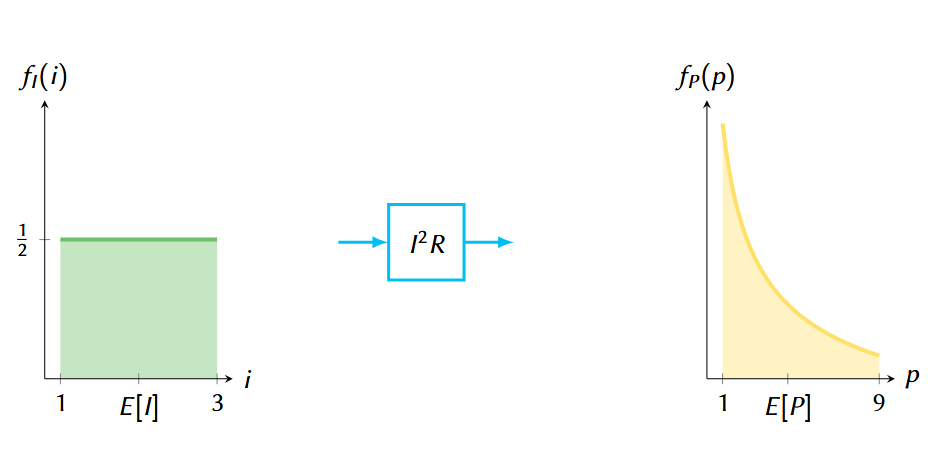
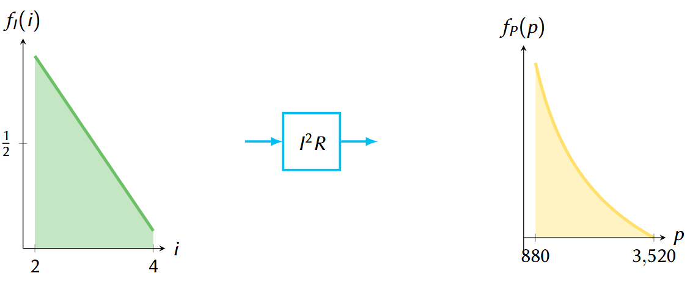

---

:material-pencil-box: **Ejemplo de disipación de potencia en un resistor**

!!! example "Disipación de potencia en un resistor"

    Sea \( I \) una variable aleatoria que denota la corriente en un resistor \( R \) de valor \(1~\Omega\).  
    \( I \) tiene una distribución uniforme en el intervalo de 1 a 3 A, es decir:

    $$
    f_I(i) =
    \begin{cases} 
    \frac{1}{2} & 1 < i < 3 \\
    0 & \text{en otra parte}
    \end{cases}
    $$

    ¿Cuál es el promedio de la corriente \( I \)?  
    ¿Cuál es el promedio de la potencia disipada en \( R \), con \( P = g(I) = I^2 R \)?

    ---
    Primero se hará el cálculo mediante E[g(I)] (como se hizo en una presentación anterior) y luego a través de la nueva función de densidad fP (p).

    $$
    \begin{aligned}
    E[I] & = \int_{-\infty}^{\infty} i \cdot f_{I}(i) \, \mathrm{d}i \\ 
        & = \int_{1}^{3} i \cdot \frac{1}{2} \, \mathrm{d}i \\
        & = 2\,\text{A}
    \end{aligned}
    $$

    

    ---
    

    $$
    \begin{aligned}
    E[P] & = \int_{1}^{3} i^2 \cdot \frac{1}{2} \, \mathrm{d}i \\
        & = \frac{13}{3} \approx \boxed{4.33\,\text{W}}
    \end{aligned}
    $$

    

    ---
    Es posible obtener \( E[P] \) desde \( f_P(p) \) por medio de la transformación \( g(I) = P = I^2 R \), con

    \[
    h(P) = I = \sqrt{\frac{P}{R}},
    \]

    y con los límites \(1 < i < 3\) y \(1 < p < 9\). Aplicando el teorema:

    \[
    f_P(p) = f_I \bigl[ h(p) \bigr] \cdot \left| h'(p) \right| = f_I \left[ \sqrt{\frac{p}{R}} \right] \cdot \left| \frac{(p/R)^{-1/2}}{2} \right|
    \]

  
    $$
    \begin{aligned}
    f_P(p) & = f_I\left( \sqrt{p} \right) \cdot \left| \frac{\mathrm{d}}{\mathrm{d}p} \sqrt{p} \right|^{-1} \\
        & = \frac{1}{2} \cdot \left| \frac{1}{2 \sqrt{p}} \right| = \boxed{\frac{1}{4 \sqrt{p}} \quad \text{para } 1 < p < 9}
    \end{aligned}
    $$

    ---
    Y su promedio es:

    $$
    \begin{aligned}
    E[P] & = \int_{1}^{9} p \cdot \frac{1}{4 \sqrt{p}} \, \mathrm{d}p = \frac{1}{4} \int_{1}^{9} \sqrt{p} \, \mathrm{d}p \\
        & = \frac{1}{4} \cdot \left. \frac{2}{3} p^{3/2} \right|_1^9 
        = \frac{13}{3} \approx \boxed{4.33\,\text{W}}
    \end{aligned}
    $$

    

  Simulación de la potencia en un resistor

import numpy as np

from scipy import stats

# Inicialización de vectores

N = 500

Irvs = [0]*N

P = [0]*N

# Distribución de la corriente

I = stats.uniform(1, 2)

# Simulación

for i in range  (N):

  Irvs[i] = I.rvs()

  P[i] = Irvs[i]**2

---

:material-pencil-box: **Ejemplo de distribución uniforme y transformaciones de una variable aleatoria**

!!! example "Distribución uniforme y transformaciones de una variable aleatoria"

    Sea \( X \sim \mathsf{unif}(0,1) \) (es decir, \( f_X(x) = 1 \) en \(0 \leq x \leq 1\)).  
    Se define una nueva variable \( Y = 2\sqrt{X} \). Encuentre \( f_Y(y) \).

    La función \( g(X) = 2\sqrt{X} \) es monótona en \([0, 1]\) y tiene una inversa \( h(y) = \frac{y^2}{4} \).

    Se aplica el teorema:

    $$
    \begin{aligned}
    f_Y(y) & = f_X(h(y)) \left| h'(y) \right| = (1) \left| \frac{d}{dy} \frac{y^2}{4} \right| \\
           & = \frac{2y}{4} \\
    \boxed{
    f_Y(y) = \frac{y}{2} \quad \text{en} \quad y \in [0, 2]
    }
    \end{aligned}
    $$

---

    
---

:material-pencil-box: **Otro ejemplo de la disipación de potencia en un resistor**

!!! example "Otro ejemplo de la disipación de potencia en un resistor"

    La variación en cierta fuente de corriente eléctrica \( X \) (en miliamperios) puede ser modelada por el PDF

    $$
    f_X(x) =
    \begin{cases}
    1.25 - 0.25 x & 2 \leq x \leq 4 \\
    0 & \text{en otros casos}
    \end{cases}
    $$

    Si esta corriente pasa por un resistor de \(220\, \Omega\), la potencia disipada es dada por la expresión \( Y = 220 X^2 \).  
    ¿Cuál es la función de densidad de \( Y \)?

    La función \( y = g(x) = 220 x^2 \) es monótonamente creciente en el rango de \( X \), \([2,4]\), y tiene función inversa  
    \( x = h(y) = g^{-1}(y) = \sqrt{\frac{y}{220}} \).

    Aplicando el teorema de transformación, entonces,

    $$
    \begin{aligned}
    f_Y(y) & = f_X(h(y)) \left| h'(y) \right| \\
           & = f_X \left( \sqrt{\frac{y}{220}} \right) \left| \frac{d}{dy} \sqrt{\frac{y}{220}} \right| \\
           & = \left(1.25 - 0.25 \sqrt{\frac{y}{220}} \right) \frac{1}{2\sqrt{220 y}} \\
           & = \frac{1}{2\sqrt{220 y}} - \frac{1}{1760}
    \end{aligned}
    $$

    Y por tanto,

    $$
    \boxed{
    f_Y(y) = 
    \begin{cases}
    \frac{1}{2\sqrt{220 y}} - \frac{1}{1760} & 880 \leq y \leq 3520 \\
    0 & \text{en otra parte}
    \end{cases}
    }
    $$

    

---

---

:material-pencil-box: **Ejemplo Transformación de variable aleatoria \( T \)**

!!! example "Transformación de variable aleatoria \( T \)"

    Hay una variable aleatoria \( T \) distribuida uniformemente en el intervalo \([1,7]\). Sobre ella se aplica una transformación

    $$
    U = T^{2} - T - 6
    $$

    1. Encontrar \( f_{U}(u) \), la función de densidad probabilística de la variable aleatoria \( U \).  
    2. Calcular \( P\{-4 < U \leq 14\} \).

    **Parte 1**: Encontrar \( f_{U}(u) \), la función de densidad probabilística de la variable aleatoria \( U \).

    La variable aleatoria \( T \) dada es

    $$
    f_T(t) =
    \begin{cases}
    \frac{1}{6} & 1 \leq t \leq 7 \\
    0	& \text{en otra parte}
    \end{cases}
    $$

    La transformación \( U = g(T) \) es monótonamente creciente en el intervalo \([1,7]\), por tanto es posible utilizar la fórmula

    $$
    f_U(u) = f_T(h(u)) \left| \frac{d}{du} h(u) \right|
    $$

    donde \( h(u) \) es la función inversa.

    Se obtiene \( h(u) \) de la forma

    $$
    \begin{aligned}
    u &= t^2 - t - 6 \\
    0 &= t^2 - t - (u + 6) \\
    t &= \frac{1 \pm \sqrt{1 - 4(-u - 6)}}{2} \quad \text{(fórmula general)} \\
      &= \frac{1 \pm \sqrt{4u + 25}}{2}
    \end{aligned}
    $$

    Se elige la solución positiva, y queda

    $$
    h(u) = \frac{1 + \sqrt{4u + 25}}{2}
    $$

    Ahora, para derivar la función inversa, se utiliza regla de la cadena   

    $$
    \begin{aligned}
    \frac{d}{du} h(u) &= \frac{d}{du} \left[ \frac{1 + \sqrt{4u + 25}}{2} \right] \\
    &= \frac{1}{2} \cdot \frac{4}{2\sqrt{4u + 25}} = \frac{1}{\sqrt{4u + 25}}
    \end{aligned}
    $$

    Y entonces, se evalúa

    $$
    f_U(u) = f_T(h(u)) \left| \frac{d}{du} h(u) \right| = \frac{1}{6} \cdot \frac{1}{\sqrt{4u + 25}}
    $$

    Evaluando también los límites de \( T \) en la transformación \( g(T) \), la función de densidad buscada es

    $$
    \boxed{
    f_U(u) =
    \begin{cases}
    \frac{1}{6 \sqrt{4u + 25}} & -6 \leq u \leq 36 \\
    0	& \text{en otra parte}
    \end{cases}
    }
    $$

    **Parte 2**: Calcular \( P\{-4 < U \leq 14\} \)

    La probabilidad \( P\{-4 < U \leq 14\} \) requiere la integración de \( f_U(u) \) en ese intervalo. Esta
    integral puede ser más o menos difícil de evaluar, pero es posible calcularla
    numéricamente con las calculadoras científicas comunes, resultando

    $$
    P\{-4 < U \leq 14\} = \int_{-4}^{14} \frac{1}{6 \sqrt{4u + 25}} \, du = \boxed{0.5}
    $$

    En todo caso, la integral (a partir de una tabla de integrales) es

    $$
    \int \frac{1}{6 \sqrt{4u + 25}} \, du = \frac{1}{12} \sqrt{4u + 25}
    $$

    y la evaluación en \([-4, 14]\) da en efecto igual a 0.5.

---
