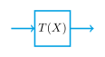
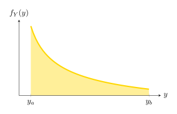

Las transformaciones permiten determinar la función de densidad probabilística de una variable aleatoria $Y$ a partir del conocimiento de otra VA $X$, relacionadas por la **función** $Y = T(X) = g(X)$. Es común en situaciones donde el resultado de un proceso o la salida de un sistema depende de una entrada aleatoria.

## Transformaciones de una variable aleatoria I

!!! tip "Problema a resolver"

    En ocasiones se desea transformar una variable aleatoria $X$ en una nueva variable aleatoria $Y$ mediante una transformación (o función):

    \begin{equation}
      Y = T(X)
    \end{equation}

  Las funciones de densidad $f_{X}(x)$ o acumulativa $F_{X}(x)$ son conocidas.  

  **El problema consiste en determinar las funciones** $F_{Y}(y)$ y $f_{Y}(y)$.

## Transformaciones de una variable aleatoria II

|                           |                           |                             |
|---------------------------|---------------------------|-----------------------------|
|  |  |  |

## Tipos de transformaciones

!!! note ""

    **X (la "entrada")** puede ser discreta, continua o mixta. 

    **T (la transformación)** puede ser lineal, no lineal, segmentada, monotónica, no monotónica...

Hay muchas combinaciones, pero se considerarán tres casos:

- **(a)** \(X\) continua y \(T\) continua y monotónica.
- **(b)** \(X\) continua y \(T\) continua pero no monotónica.
- **(c)** \(X\) discreta y \(T\) continua.

# (a) Transformaciones monotónicas de una VA continua

## Transformaciones monotónicas de una VA continua I

## Transformaciones monotónicas de una VA continua II

!!! note ""

    Una transformación o función $T$ es *monotónicamente creciente* en un intervalo si

    $$ T(x_1) < T(x_2) \quad \text{para cualquier} \quad x_1 < x_2 $$

**Transformaciones crecientes**

Supóngase que $T$ es continua y diferenciable en todo valor de $x$ para el que $f_X(x) \neq 0$ (es decir, donde $X$ tiene *soporte*). Para un valor $x_0$ cualquiera en el intervalo se cumple que

\begin{equation}
y_0 = T(x_0) \quad \text{y} \quad x_0 = T^{-1}(y_0)
\end{equation}

donde $T^{-1}$ representa el inverso de la transformación $T$.

## Transformaciones monotónicas de una VA continua III

**Premisa (el método CDF)**

!!! note ""

    La probabilidad del evento \( \{Y \leq y_0\} \) debe igualar la probabilidad del evento \( \{X \leq x_0\} \) debido a la correspondencia entre \(X\) e \(Y\).

Así entonces, debe cumplirse que

\begin{equation}
F_{Y}(y_0) = P\{Y \leq y_{0}\} = P\{X \leq x_0 \} = F_{X}(x_0)
\end{equation}

y mediante la definición de la CDF a partir de la PDF

\begin{equation}
  \int_{-\infty}^{y_0} f_{Y}(y) \mathrm{d} y = \int_{-\infty}^{x_0 = T^{-1}(y_0)} f_{X}(x) \mathrm{d} x
\label{Juno}
\end{equation}

Por lo que resta despejar para $f_Y(y)$, que es la función de interés.

## Regla de Leibniz I

Si $H(x,u)$ es continua en las variables $x$ y $u$, y además  

\begin{equation}
  G(u) = \int_{\alpha(u)}^{\beta(u)} H(x,u) \mathrm{d} x
\end{equation}

entonces la derivada de la integral respecto al parámetro $u$ es:

\begin{equation}
  \frac{\mathrm{d} G(u)}{\mathrm{d} u} = H\left[ \beta(u), u \right] \frac{\mathrm{d} \beta(u)}{\mathrm{d} u}  
  - H\left[\alpha(u), u\right] \frac{\mathrm{d} \alpha(u)}{\mathrm{d} u}  
  + \int_{\alpha(u)}^{\beta(u)} \frac{\partial H(x,u)}{\partial u} \mathrm{d} x
\end{equation}

## Regla de Leibniz II

En nuestro escenario, y considerando que el límite inferior de $f_X(x)$ es $T^{-1}(y_a)$ y que es una constante (posiblemente $-\infty$), aplica que  

\begin{multline}
  f_Y(y_0) = f_X\left[ T^{-1}(y_0), y_0 \right] \frac{\mathrm{d} T^{-1}(y_0)}{\mathrm{d} y_0} \\  
  - f_X\left[T^{-1}(y_a), y_0\right] \left(\frac{\mathrm{d} T^{-1}(y_a)}{\mathrm{d} y} = 0\right)   
  + \int_{T^{-1}(y_a)}^{T^{-1}(y_0)} \left(\frac{\partial f_X(x)}{\partial y} = 0\right) \mathrm{d} x
\end{multline}

## Transformación monotónica creciente  I

Con base en la regla de Leibniz, evaluada anteriormente, se obtiene  

\begin{equation}
  f_{Y}(y_0) = f_{X}\left[ T^{-1}(y_0) \right] \frac{\mathrm{d} T^{-1}(y_0)}{\mathrm{d} y_0}
\end{equation}

pero como la ecuación anterior aplica para cualquier $y_0$, se puede eliminar el subíndice y reescribir  

\begin{equation}
\boxed{
f_{Y}(y) = f_{X}\left[ T^{-1}(y) \right] \frac{\mathrm{d} T^{-1}(y)}{\mathrm{d} y}
}
\label{Leibniz1}
\end{equation}

que es la función de densidad buscada de $Y$, en términos de la transformación (inversa) aplicada a $X$, para $T$ monotónicamente **creciente**.

## Transformación monotónica decreciente I

## Transformación monotónica decreciente II

**Tranformación monotónica decreciente**

!!! note ""

    Una transformación o función $T$ es *monotónicamente decreciente* en un intervalo si  

    $$ T(x_1) > T(x_2) \quad \text{para cualquier} \quad x_1 < x_2 $$

Si se considera el caso de la transformación decreciente, se escribe:

\begin{equation}
F_{Y}(y_0) = P\{ Y \leq y_0\} = P\{ X \geq x_0\} = 1 - F_{X}(x_0)
\end{equation}

Siguiendo el mismo razonamiento usado para obtener la ecuación (\ref{Leibniz1}), se obtendrá  

\begin{equation}
\boxed{
f_{Y}(y) = -f_{X}\left[ T^{-1}(y) \right] \frac{\mathrm{d} T^{-1}(y)}{\mathrm{d} y}
}
\label{Leibniz2}
\end{equation}

## Teorema de transformación monotónica I

Dado que la pendiente de $T^{-1}(y)$ es negativa pues la función es decreciente, se concluye que para cualquier tipo de transformación monotónica:

!!! note "Teorema de transformación monotónica"

    \begin{equation}
    f_{Y}(y) = f_{X}\left[ T^{-1}(y) \right] \left| \frac{\mathrm{d} T^{-1}(y)}{\mathrm{d} y} \right|  
    \end{equation}

**Recordatorio:** Es importante notar que la ``monotonicidad'' se evalúa en la función $g(X)$ (la transformación $T(X)$) y no tiene que ver con la función de densidad $f_X(x)$ (error de análisis común).

## Teorema de transformación monotónica II

!!! note "Notación alternativa del teorema de transformación"
    En ocasiones se utiliza la notación \( Y = g(X) \) para la transformación, y \( X = h(Y) \) como la transformación inversa. El teorema se enuncia entonces como

    \begin{equation}
    f_Y(y) = f_X\left[ h(y) \right] \left\vert \frac{\mathrm{d} h(y)}{\mathrm{d} y} \right\vert
    \end{equation}