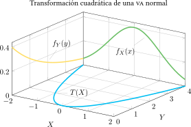
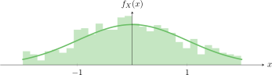

# Transformaciones no monotónicas de una va continua

En general, puede ser que haya más de un intervalo de valores de $X$ que correspondan al evento $\{Y \leq y_0\}$. Por ejemplo, puede darse el caso que, para un dado $y_0$, el evento $\{Y \leq y_0 \}$ corresponde al evento $\{ X \leq x_{1}, x_{2} \leq X < x_{3} \}$. 

**Premisa.** La probabilidad del evento $\{ Y \leq y_{0}\}$ iguala la probabilidad del evento $\{ \text{valores de } x \text{ que dan } Y \leq y_0 \}$ que se escribirá como $\{x : Y \leq y_{0}\}$. En otras palabras, 

\begin{equation}
\begin{aligned}
  F_{Y}(y_0) & = P\{Y \leq y_0\} \\ & = P\{x : Y \leq y_{0}\} = \int_{\{x : Y\leq y_0\}}f_{X}(x) ~\mathrm{d} x
\end{aligned}
\end{equation}

Se puede derivar formalmente el resultado anterior para obtener la densidad de $Y$

\begin{equation}
  f_{Y}(y_{0}) = \frac{~\mathrm{d}}{{dy_{0}}} {\int_{\{x : Y \leq y_{0}\}}f_{X}(x) ~\mathrm{d} x}
\end{equation}

Y la función de densidad está dada (sin demostración) por

!!! tip "Teorema de transformación no monotónica"
    $f_{Y}(y) = \sum_{n}\frac{f_{X}(x_{n})}{\left| \ \frac{~\mathrm{d}}{{dx}} \left. T(x) \right|_{x = x_{n}} \right| }$
    donde la suma incluye las raíces $x_{n}, n = 1, 2, \ldots,$ que son las soluciones reales de la ecuación $y = T(x)$. Si $y = T(x)$ no tiene raíces reales para un valor dado de $y$, entonces $f_{Y}(y) = 0$.

---

:material-pencil-box: **EJEMPLO**

!!! example "Ejemplo de la transformación de ley cuadrada"
    Hallar $f_{Y}(y)$ para la transformación de ley cuadrada $Y = T(X) = cX^{2}$, donde $c > 0 \in \mathbb{R}$.

No hay más información sobre $X$ pero se asumirá que tiene soporte en todo $\mathbb{R}$ (o que al menos tiene valores positivos y negativos, y por tanto no es monotónica la transformación $Y = cX^{2}$). Por el tipo de transformación, el dominio de $Y$ es $y > 0$.

Para la solución se utilizará dos métodos.

**Método 1** : *El método CDF* --- El evento $\{Y \leq y\}$ ocurre cuando $\{ -\sqrt{y/c} \leq x \leq \sqrt{y/c}\} = \{ x : Y \leq y\}$, con lo que

\begin{equation}
\begin{aligned}
F_{Y}(y) &= \int_{-\sqrt{y/c}}^{\sqrt{y/c}} f_{X}(x)\, dx \\
f_{Y}(y) &= \dfrac{d}{dy} \int_{-\sqrt{y/c}}^{\sqrt{y/c}} f_{X}(x)\, dx \qquad \text{CDF} \Rightarrow \text{PDF}
\end{aligned}
\end{equation}

Se aplica ahora la regla de Leibniz:

\begin{equation}
\begin{aligned}
f_{Y}(y) &= f_{X}(\sqrt{y/c})\left( \frac{1}{\sqrt{c}} \right)\left( \frac{1}{2\sqrt{y}} \right) \\
        &\quad - f_{X}(-\sqrt{y/c})\left( -\frac{1}{\sqrt{c}} \right)\left( \frac{1}{2\sqrt{y}} \right) \\
        &= \boxed{\frac{f_{X}(\sqrt{y/c}) + f_{X}(-\sqrt{y/c})}{2\sqrt{yc}} \quad \text{para} \quad y > 0}
\end{aligned}
\end{equation}

**Método 2** : *Por el teorema de transformación* --- Si se despeja $X$ de la ecuación $Y = cX^2$ se encuentra:

\begin{equation}
\begin{aligned}
{Y}/{c} & = X^2 \\
  X & = \pm \sqrt{Y/c}
\end{aligned}
\end{equation}
 
de modo que las soluciones son $x_1 = -\sqrt{y/c}$, y $x_2 = \sqrt{y/c}$. Además, $\frac{~\mathrm{d}}{{dx}}T(x) = 2xc,$ 

\begin{equation}
  \left. \frac{~\mathrm{d}}{{dx}}T(x) \right|_{x = x_1} = 2c\left[ -\sqrt{\frac{y}{c}} \right] = -2\sqrt{yc}
\end{equation}

\begin{equation}
  \left. \frac{~\mathrm{d}}{{dx}}T(x) \right|_{x = x_2} = 2c\left[ \sqrt{\frac{y}{c}} \right] = 2\sqrt{yc}
\end{equation}

Finalmente, se evalúa en la ecuación \eqref{E:no_monotonica}

\begin{equation}
  f_{Y}(y) = \sum_{n}\frac{f_{X}(x_{n})}{\left| \frac{~\mathrm{d}}{{dx}}\left. T(x) \right|_{x = x_{n}} \right| }
\end{equation}

y se obtiene

\begin{equation}
\begin{aligned}
f_{Y}(y) &= \frac{f_{X}(-\sqrt{y/c})}{\lvert -2\sqrt{cy} \rvert} + \frac{f_{X}(\sqrt{y/c})}{\lvert 2\sqrt{yc} \rvert} \\
        &= \boxed{\frac{f_{X}(-\sqrt{y/c}) + f_{X}(\sqrt{y/c})}{2\sqrt{yc}} \quad \text{para} \quad y \geq 0}
\end{aligned}
\end{equation}

confirmando el resultado.

---  

---

:material-pencil-box: **EJEMPLO**

!!! example "Ejemplo de la transformación cuadrática de una va normal"
    Para la transformación $Y = T(X) = X^2$, encontrar $f_Y(y)$ con $X \sim \mathcal{N}(0,1)$.

Utilizando el resultado de la ecuación anterior
con $c = 1$, y conociendo además que

\begin{equation}
    X \sim \mathcal{N}(0,1) \longrightarrow f_X(x) = \frac{1}{\sqrt{2\pi}} e^{-x^2/2}
\end{equation}

\begin{equation}
\begin{aligned}
f_{Y}(y) & = \frac{f_{X}(-\sqrt{y}) + f_{X}(\sqrt{y})}{2\sqrt{y}} = \frac{\frac{1}{\sqrt{2\pi}} e^{-(-\sqrt{y})^2/2} + \frac{1}{\sqrt{2\pi}} e^{-(\sqrt{y})^2/2}}{2\sqrt{y}} = \frac{1}{\sqrt{2\pi y}} e^{-y/2}
\end{aligned}
\end{equation}

---