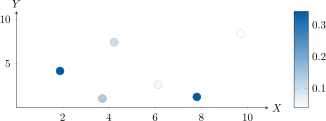
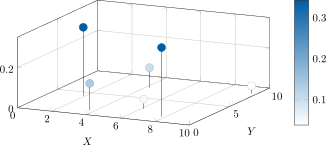
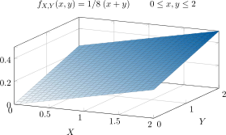

## Variables aleatorias múltiples

- Las **variables aleatorias múltiples** pasan de un espacio de probabilidades $(S \rightarrow \mathbb{R}^1, P)$, llamado "ordinario" o "marginal", a otro $(S \rightarrow \mathbb{R}^n, P)$, llamado también "conjunto" o "multidimensional". Por ejemplo:

!!! example "Tabla marginal"
    | X    | P     |
    |------|-------|
    | 6.13 | 0.047 |
    | 4.23 | 0.099 |
    | 7.81 | 0.343 |
    | 9.71 | 0.038 |
    | 3.72 | 0.134 |
    | 1.89 | 0.339 |
    | *Total* | **1.000** |

!!! example "Tabla conjunto"
    | X    | Y    | Z    | P     |
    |------|------|------|-------|
    | 6.13 | 2.61 | 0.02 | 0.216 |
    | 4.23 | 7.41 | 3.64 | 0.160 |
    | 7.81 | 1.23 | 4.23 | 0.028 |
    | 9.71 | 8.39 | 9.93 | 0.191 |
    | 3.72 | 1.04 | 7.86 | 0.198 |
    | 1.89 | 4.16 | 2.97 | 0.207 |
    |      |      | *Total* | **1.000** |

---

- Supóngase que dos variables aleatorias $X$ y $Y$ están definidas sobre un espacio $S$ de muestras. Cualquier par ordenado de números $(x, y)$ puede considerarse un punto aleatorio en el plano $XY$ y es un valor específico de un **vector aleatorio** $[X, Y]$.

---

- Cuando hay un número discreto de pares ordenados, cada uno tiene asociada una probabilidad de ocurrencia no nula $P(x_m,y_n) = p_{m,n}$. Es necesario que:

$$
\sum_m^M \sum_n^N p_{m,n} = 1
$$

---

- Una representación posible para la magnitud de la probabilidad es la de un gráfico bidimensional con un código de colores según una escala.

---

- Otra representación usual es una gráfica tridimensional con el eje $z$ siendo la probabilidad para todo $(x_i, y_i)$. La mostrada es una función de probabilidad de **masa** conjunta, donde el marcador además tiene un color asociado con su magnitud.

---

- Cuando $X$ y $Y$ son continuos, existe una función de densidad de probabilidad $f_{X,Y}(x,y)$ definida para todo $x$ y $y$, y la gráfica tridimensional es una superficie.

Ejemplo:

$$
f_{X,Y}(x,y) = \frac{1}{8}(x + y), \quad 0 \leq x, y \leq 2
$$

# Función acumulativa conjunta

---

## Probabilidad de un evento conjunto \( A \cap B \)
### Deducción de la función acumulativa para variables aleatorias múltiples

Similar al caso de una variable aleatoria ordinaria, definamos los eventos \( A \) y \( B \) como:

El evento \( A \cap B \) definido en \( S \) corresponde al evento conjunto \( \{ X \leq x \land Y \leq y \} \), también expresado como \( \{X \leq x, Y \leq y\} \), definido en \( S_J \), donde \( S_J \) es el espacio de muestras en \( xy \), o también *espacio producto bidimensional*.

---

## La función acumulativa conjunta de VA **continuas**

!!! tip "**Función de probabilidad acumulativa conjunta continua**"
    La probabilidad del evento conjunto \( \{X \leq x, Y \leq y\} \) es una **función acumulativa conjunta** denotada por:

    $$
    F_{X,Y}(x,y) = P( X \leq x, Y \leq y )
    $$

donde \( P(X \leq x, Y \leq y) = P(A \cap B) \).

---

## La función acumulativa conjunta de VA **discretas**

!!! tip "**Función de probabilidad acumulativa conjunta discreta**"
    La función acumulativa conjunta para dos variables aleatorias discretas \( X \) (con \( N \) posibles valores \( x_n \)) y \( Y \) (con \( M \) posibles valores \( y_m \)), es:

    $$
    F_{X,Y}(x,y) = \sum_{n=1}^{N} \sum_{m = 1}^{M} P(x_n, y_m) \, u(x - x_n) \, u(y - y_m)
    $$

donde \( P(x_n, y_m) \) es la probabilidad del evento conjunto \( \{X = x_n, Y = y_m\} \), y \( u(\cdot) \) es la función escalón unitario.

---

## Generalización de la función de probabilidad acumulativa para \( N \) VA
!!! note ""
    Para \( N \) variables aleatorias \( X_n \), \( n = 1, 2, \ldots, N \), la generalización es directa:

    $$
    F_{X_1, X_2, \ldots, X_N}(x_1, x_2, \ldots, x_N) = P\{X_1 \leq x_1, X_2 \leq x_2, \ldots, X_N \leq x_N\}
    $$

