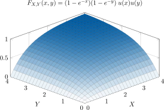

# Propiedades de la función acumulativa conjunta

1. **La probabilidad de estar por debajo de $-\infty$ es cero**

    $$
F_{X,Y}(-\infty, -\infty) = 0 \quad F_{X,Y}(-\infty, y) = 0 \quad F_{X,Y}(x, -\infty) = 0
    $$

2. **La probabilidad de estar por debajo de $+\infty$ es uno**

    $$
F_{X,Y}(\infty, \infty) = 1
    $$

3. **La función acumulativa conjunta es una probabilidad**

    $$
0 \leq F_{X,Y}(x,y) \leq 1
    $$

4. **$F_{X,Y}(x,y)$ es una función no decreciente tanto de $X$ como de $Y$**
   

5. **La probabilidad en una región $\mathcal{R} = \{x_1 < X \leq x_2, y_1 < Y \leq y_2\}$ es**

    $$
P\{x_1 < X \leq x_2, y_1 < Y \leq y_2\}=F_{X,Y}(x_2,y_2) + F_{X,Y}(x_1,y_1) - F_{X,Y}(x_1,y_2) - F_{X,Y}(x_2,y_1)  \geq 0
    $$

6. **Funciones acumulativas marginales**
    
    - 6a. **Función acumulativa marginal de $X$**
    
        $$
        F_{X,Y}(x, \infty) = F_X(x)
        $$

    - 6b. **Función acumulativa marginal de $Y$**
    
        $$
        F_{X,Y}(\infty, y) = F_Y(y)
        $$

### Nota sobre la propiedad 6
Obsérvese que

$$
F_{X,Y}(x,y) = P\{X \leq x, Y \leq y\} = P(A \cap B)
$$

Si se hace que $y = \infty$, esto equivale a hacer $B = \{Y \leq y\}$ el evento seguro; es decir, $B = \{Y \leq \infty\} = S$. Además, dado que $A \cap B = A \cap S = A$, entonces se tiene

$$
\boxed{F_{X,Y}(x, \infty) = P(A \cap S) = P(A) = P( X \leq x ) = F_{X}(x)}
$$

Una prueba similar puede establecerse para $F_Y(y)$.

!!! tip "Generalización de las distribuciones marginales"

    De una función de distribución conjunta $N$-dimensional se puede obtener una función de distribución marginal $K$-dimensional, para cualquier grupo escogido de $K$ de las $N$ variables aleatorias, con fijar los valores de las otras $N-K$ variables aleatorias a infinito. Aquí $K$ puede ser cualquier entero $1, 2, 3, \ldots, N - 1$.

Por ejemplo, si existe $F_{W,X,Y,Z}(w,x,y,z)$ y nos interesa la función acumulativa marginal para $W$ y $X$, hay que hacer:

$$
F_{W,X}(w,x) = F_{W,X,Y,Z}(w,x,\infty,\infty)
$$

---

:material-pencil-box: **EJEMPLO**
!!! example "Ejemplo de una función acumulativa bivariada continua"

    

---

# Función de densidad probabilística conjunta

## Función de densidad probabilística conjunta de variables aleatorias **continuas**

!!! tip "Función de densidad probabilística conjunta bivariada continua"

    Para dos variables aleatorias $X$ y $Y$, la función de densidad probabilística conjunta, $f_{X,Y}(x,y)$, está definida por la segunda derivada de la función de distribución conjunta (dondequiera que esta exista),

    $$
    f_{X,Y}(x,y) = \frac{\partial^2 F_{X,Y}(x,y)}{\partial x \partial y}
    $$

## Función de densidad probabilística conjunta de variables aleatorias **discretas**

!!! tip "Función de densidad probabilística conjunta bivariada discreta"

    La función de densidad conjunta para dos variables aleatorias discretas está dada por:

    $$
    f_{X,Y}(x,y) = \sum_{n=1}^{N}\sum_{m=1}^{M}P(x_n,y_m)\delta(x-x_n)\delta(y-y_m)
    $$

---

:material-pencil-box: **EJEMPLO**

!!! example "Ejemplo de una función de densidad bivariada discreta"

    Valores de probabilidad para la combinación de una variable aleatoria $X$ con otra $Y$. Por ejemplo, los valores de $X$ podrían representar **intervalos** de la estatura de una población, y $Y$ de su peso.

    | $P(x_n, y_m)$ | $y_1$   | $y_2$   | $y_3$   | $y_4$   | $y_5$   | $y_6$   | $y_7$   |
    |--------------|---------|---------|---------|---------|---------|---------|---------|
    | $x_1$        | 0.00164 | 0.00572 | 0.01211 | 0.01555 | 0.01211 | 0.00572 | 0.00164 |
    | $x_2$        | 0.00735 | 0.02564 | 0.05427 | 0.06969 | 0.05427 | 0.02564 | 0.00735 |
    | $x_3$        | 0.01211 | 0.04227 | 0.08948 | 0.11490 | 0.08948 | 0.04227 | 0.01211 |
    | $x_4$        | 0.00735 | 0.02564 | 0.05427 | 0.06969 | 0.05427 | 0.02564 | 0.00735 |
    | $x_5$        | 0.00164 | 0.00572 | 0.01211 | 0.01555 | 0.01211 | 0.00572 | 0.00164 |

    

    Se visualiza un comportamiento doblemente normal en la figura.

---

## Generalización de la función de densidad probabilística para $N$ variables aleatorias

!!! note ""

    Cuando $N$ variables aleatorias $X_1, X_2, \ldots, X_N$ están involucradas, la función de densidad conjunta se convierte en la $N$-ésima derivada parcial de la función de distribución $N$-dimensional

    $$
    f_{X_1, X_2, \ldots, X_N}(x_1, x_2, \ldots, x_N) = \frac{\partial^{N}F_{X_1, X_2, \ldots, X_{N}}(x_1, x_2, \ldots, x_N)}{\partial x_1 \partial x_2 \cdots \partial x_N}
    $$

Por integración directa este resultado es equivalente a:

$$
F_{X_1, \ldots, X_N}(x_1, \ldots, x_N) = \int_{-\infty}^{x_N} \cdots \int_{-\infty}^{x_1}f_{X_1, \ldots, X_N}(v_1, \ldots, v_N)~\mathrm{d}v_1 \cdots \mathrm{d}v_N
$$