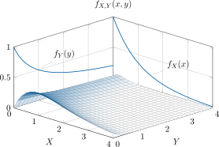

# Propiedades de la función de densidad conjunta
---

1) La función de densidad es siempre positiva:

$$
f_{X,Y}(x,y) \geq 0
$$

---

2) El volumen bajo la superficie en todo el plano \( XY \) es unitario:

$$
\int_{-\infty}^{\infty} \int_{-\infty}^{\infty} f_{X,Y}(x,y)\,\mathrm{d} x\,\mathrm{d} y = 1
$$

---

3) La probabilidad en una región \( \mathcal{R} \) es el volumen bajo la superficie en \( \mathcal{R} \):

$$
P(x_1 < X \leq x_2,\ y_1 < Y \leq y_2) =
\int_{y_1}^{y_2} \int_{x_1}^{x_2} f_{X,Y}(x,y)\,\mathrm{d} x\,\mathrm{d} y
$$

---

4) La función acumulativa conjunta es el volumen bajo la superficie de la región \( \{ X \leq x,\ Y \leq y \} \) de la función de densidad:

$$
F_{X,Y}(x,y) = P(X \leq x,\ Y \leq y) =
\int_{-\infty}^{y} \int_{-\infty}^{x} f_{X,Y}(v_1,v_2)\,\mathrm{d} v_1\,\mathrm{d} v_2
$$

---

5) Funciones acumulativas marginales:

5a. Función acumulativa marginal de \( X \):

$$
F_X(x) = \int_{-\infty}^{x} \int_{-\infty}^{\infty} f_{X,Y}(v_1,v_2)\,\mathrm{d} v_2\,\mathrm{d} v_1
$$

5b. Función acumulativa marginal de \( Y \):

$$
F_Y(y) = \int_{-\infty}^{y} \int_{-\infty}^{\infty} f_{X,Y}(v_1,v_2)\,\mathrm{d} v_1\,\mathrm{d} v_2
$$

---

6) Funciones de densidad marginales:

6a. Función de densidad marginal de \( X \):

$$
f_X(x) = \int_{-\infty}^{\infty} f_{X,Y}(x,y)\,\mathrm{d} y = \frac{d}{\mathrm{d} x} F_X(x)
$$

6b. Función de densidad marginal de \( Y \):

$$
f_Y(y) = \int_{-\infty}^{\infty} f_{X,Y}(x,y)\,\mathrm{d} x = \frac{d}{\mathrm{d} y} F_Y(y)
$$

---

:material-pencil-box: **EJEMPLO**

!!! example "¿Cómo se calculan funciones de densidad marginales?"

       Encuentre \( f_X(x) \) y \( f_Y(y) \) cuando la función de densidad conjunta es:

       $f_{X,Y}(x,y) = x\,e^{-x(y+1)}\,u(x)\,u(y)$

Gráfica de la función en cuestión:

Para la solución, se debe tomar la función de densidad conjunta e integrar primero sobre todo el ámbito de valores de la variable aleatoria $Y$, para obtener la función de densidad de $X$:

$$
\begin{aligned}
f_X(x) &= \int_{-\infty}^{\infty} u(x)u(y)\,x\,e^{-x(y+1)}\,\mathrm{d} y \\
       &= u(x)\,x\,e^{-x} \int_{0}^{\infty} e^{-x y}\,\mathrm{d} y \\
       &= u(x)\,x\,e^{-x} \left[ \frac{e^{-x y}}{-x} \right] \Big|_0^{\infty} \\
       &= e^{-x} u(x)
\end{aligned}
$$

Luego, se toma la función de densidad conjunta y se integra sobre todo el ámbito de valores de la variable aleatoria $X$, para obtener la función de densidad de $Y$:

$$
\begin{aligned}
f_Y(y) &= \int_{-\infty}^{\infty} u(x)u(y)\,x\,e^{-x(y+1)}\,\mathrm{d} x \\
       &= u(y) \int_{0}^{\infty} x\,e^{-x(y+1)}\,\mathrm{d} x \\
       &= u(y) \left[
         -\frac{x\,e^{-x(y+1)}}{y+1} \Big|_0^{\infty}
         -\frac{e^{-x(y+1)}}{(y+1)^2} \Big|_0^{\infty}
       \right] \\
       &= \frac{1}{(y+1)^2} u(y)
\end{aligned}
$$

!!! note "En estos cálculos se utilizó la técnica de la integración por partes"

Y finalmente:

!!! note ""

       Se tienen las funciones de densidad marginales de $f_{X,Y}(x,y)$:
       
       $f_X(x) = e^{-x} u(x)$

       $f_Y(y) = \frac{1}{(y+1)^2} u(y)$

Gráfica de las funciones obtenidas:

---