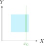

# Independencia estadística

!!! tip "Independencia estadística de variables aleatorias múltiples"
    Dos variables aleatorias son estadísticamente independientes si y solo si

    \begin{equation}
    P( X \leq x, Y \leq y ) = P( X\leq x) P( Y\leq y )
    \end{equation}

Lo anterior implica que

\begin{equation}
F_{X,Y}(x,y) = F_{X}(x)F_{Y}(y)
\end{equation}

y 

\begin{equation}
f_{X,Y}(x,y) = f_{X}(x)f_{Y}(y)
\end{equation}

Si $X, Y$ son estadísticamente independientes:

\begin{equation}
\begin{aligned}
  F_{X}(x| Y \leq y) & = \frac{P\{X \leq x, Y \leq y\}}{P\{Y \leq y\}} \\
                    & = \frac{F_{X,Y}(x,y)}{F_{Y}(y)} \\
                  	& = F_{X}(x)
\end{aligned}
\end{equation}

Lo mismo sucede con $F_{Y}(y| X\leq x)$. Además, si se mantiene la misma condición de independencia estadística para $X,Y$:

\begin{equation}
\begin{aligned}
  f_{X}(x | Y \leq y) & = f_{X}(x) \\
  f_{Y}(y | X \leq x) & = f_{Y}(y)
\end{aligned}
\end{equation}

---

:material-pencil-box: **EJEMPLO**

!!! example "Ejemplos de dependencia e independencia estadística"
    - Una densidad conjunta bivariada *uniforme* **cuadrada**:

        

    - Una densidad conjunta bivariada *uniforme* **circular**:

        

---

:material-pencil-box: **EJEMPLO**

!!! example "Ejemplo de la variable aleatoria conjunta doblemente exponencial"
    Para la función de densidad de $(X, Y)$ dada, ¿son $X$ y $Y$ independientes?

    \begin{equation}
    f_{X,Y}(x,y) =
    \begin{cases}
        2 e^{-(x + 2y)} & x \geq 0, y \geq 0 \\
        0 & \text{en otra parte}
    \end{cases}
    \end{equation}

    

Las densidades marginales se encuentran con las ecuaciones:

- Densidad marginal de $X$:

    \begin{equation}
    f_X(x) = 2 e^{-x} \int_0^{\infty} e^{-2y} ~\mathrm{d}y = \boxed{e^{-x}} \quad \text{para} \quad x \geq 0
    \end{equation}

- Densidad marginal de $Y$:

    \begin{equation}
    f_Y(y) = 2 e^{-2y} \int_0^{\infty} e^{-x} ~\mathrm{d}x = \boxed{2e^{-2y}} \quad \text{para} \quad y \geq 0
    \end{equation}

La independencia se evalúa con la ecuación:

\begin{equation}
f_X(x) f_Y(y) = (e^{-x})(2e^{-2y}) = 2 e^{-(x+2y)} = f_{X,Y}(x,y) \quad \text{para} \quad x,y \geq 0
\end{equation}

!!! note ""
    Por lo tanto, $X$ y $Y$ son independientes.

---