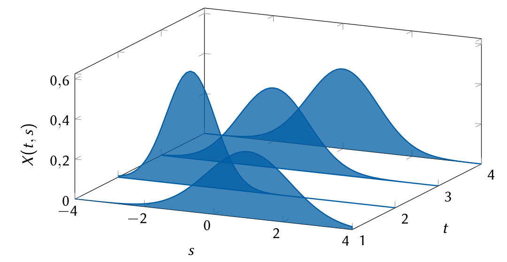
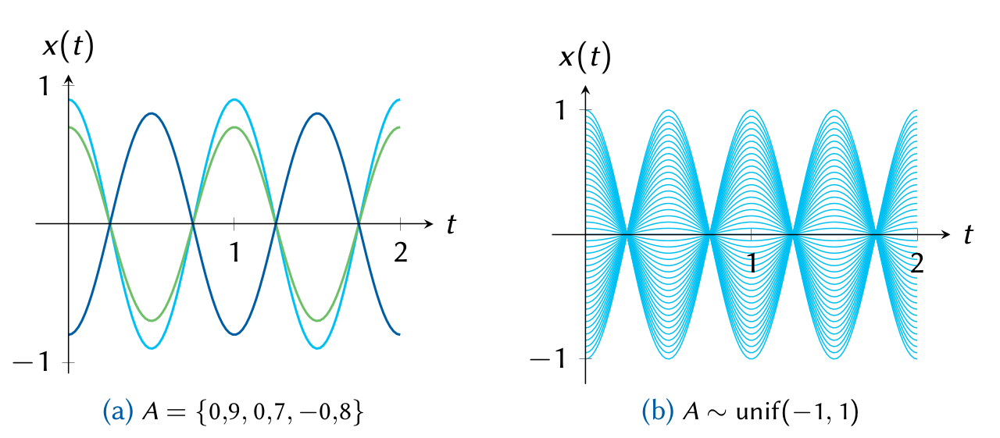

## Clasificación de procesos

!!! tip "Definición de una variable aleatoria"
    
    - Proceso aleatorio continuo El caso si $X$ es un proceso continuo y $t$ toma un continuo de valores.

    - Proceso aleatorio discreto Corresponde a la variable aleatoria $X$ que toma solamente valores discretos mientras que $t$ es continuo. 

    - Secuencia aleatoria continua Un proceso aleatorio para el que $X$ es continuo pero el tiempo tiene solamente valores discretos (al muestrear periódicamente los miembros del agregado de un proceso aleatorio continuo). 

    - Secuencia aleatoria discreta Corresponde al caso de variables aleatorias discretas y tiempo discreto.

|                  | **Valores continuos**    | **Valores discretos**   |
|------------------|--------------------------|-------------------------|
| **Tiempo continuo** | Proceso aleatorio continuo | Proceso aleatorio discreto |
| **Tiempo discreto**  | Secuencia aleatoria continua | Secuencia aleatoria discreta |

---

:material-pencil-box: **EJEMPLO**

!!! example "Ejemplo de una secuencia aleatoria continua"
    A continuación, se presenta una representación gráfica de una secuencia aleatoria continua.

---

## Procesos determinísticos y no determinísticos

Un proceso aleatorio puede describirse por **la forma de sus funciones muestra**. 

- Si valores futuros de cualquier función muestra no pueden ser predichos exactamente de valores observados pasados, el proceso se denomina **no determinístico**. 

- Un proceso se llama **determinístico** si los valores futuros de cualquier función muestra pueden ser predichos de valores pasados. 

---

:material-pencil-box: **EJEMPLO**

!!! example "Ejemplo de proceso aleatorio determinístico con función exponencial"
    Sea un proceso aleatorio definido por:

    \[
    X(t) = A e^{-t} u(t)
    \]

    donde $A$ es una variable aleatoria discreta que puede tomar los valores $\{ 1, 2, 3 \}$ con igual probabilidad.

---

---

:material-pencil-box: **EJEMPLO**

!!! example "Ejemplo de variaciones en la amplitud para una onda sinusoidal"
    Una señal tiene la forma deseada:

    \[
    v(t) = v_0 + a \cos (\omega_0 t + \theta_0)
    \]

    pero su recepción puede estar seriamente afectada por un canal de transmisión que agrega ruido, inflexiones de onda, reverberaciones, etc. Se puede por ahora asumir que existen únicamente variaciones aleatorias en la amplitud, modeladas como un proceso aleatorio:

    \[
    X(t) = v_0 + A \cos (\omega_0 t + \theta_0)
    \]

    donde $A \sim \mathsf{unif}(-1,1)$.

    !!! note ""
        Para $A \sim \mathsf{unif}(-1,1)$, $v_0 = 0$, $\omega_0 = 2\pi$ y $\theta_0 = 0$ se tiene la siguiente representación gráfica:

---

:material-pencil-box: **EJEMPLO**

!!! example "Función general para variaciones en la amplitud"
    En general, para una función de la forma:

    \[
    X(t) = A\cos\left( \omega_{0}t + \Theta \right)
    \]

    $A$, $\Theta$ u $\omega_{0}$ (o todos) pueden ser variables aleatorias. Cualquier función muestra corresponde a la ecuación anterior con valores particulares de estas variables aleatorias.

    - Si se conoce la función muestra en un instante del tiempo, se puede predecir su comportamiento futuro, dado que la forma es conocida y, por lo tanto, **determinística**.

!!! note ""
        Se deben cambiar las imágenes 13_variaciones_aleatorias.png y 13_secuencia_aleatoria.png por el svg correspondiente debido a que no se adjuntó en la carpeta images.