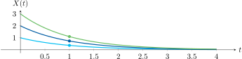

# Funciones de distribución de un proceso aleatorio

!!! tip "Función de probabilidad acumulativa de primer orden"
    Para un tiempo particular $t_1$, la función de probabilidad acumulativa asociada con la variable aleatoria $X_1 = X(t_1)$, será denotada $F_{X}(x_1; t_1)$ y es conocida más precisamente como la función acumulativa de primer orden del proceso $X(t)$. Se le define como
    
    \begin{equation}
      F_{X}(x_1; t_1) = P( X(t_1) \leq x_1)
    \end{equation}
    
    para cualquier número real $x_1$.

!!! tip "Función de probabilidad acumulativa de segundo orden"
    Para dos variables aleatorias $X_1 = X(t_1)$ y $X_2 = X(t_2)$, la función acumulativa conjunta de segundo orden es la extensión bidimensional de la fórmula anterior: 
    
    \begin{equation}
      F_{X}(x_1, x_2;t_1,t_2) = P\{X(t_1) \leq x_1, X(t_2) \leq x_2\} 
    \end{equation}
    
    De manera similar, para $N$ variables aleatorias $X_i = X(t_i), i = 1, 2, \ldots, N$, la función acumulativa conjunta de orden $N$ es
    
    \begin{equation}
      F_{X}(x_1, \ldots, x_N; t_1, \ldots, t_N) = P\{X(t_1) \leq x_1, \ldots, X(t_N) \leq x_N\}
    \end{equation}

!!! tip "Funciones de densidad de probabilidad"
    Las funciones de densidad conjunta de interés se encuentran de las derivadas apropiadas de las tres fórmulas anteriores: 
    
    \begin{aligned}
      f_{X}(x_1;t_1) & = \frac{\partial}{\partial x_1} F_{X}(x_1;t_1) \\
      f_{X}(x_1, x_2; t_1, t_2) & = \frac{\partial^2 F_{X}(x_1, x_2; t_1,t_2)}{\partial x_1 \partial x_2} \\
      f_{X}(x_1, \ldots, x_{N}; t_1, \ldots, t_N) & = \frac{\partial^{N} F_{X}(x_1, \ldots, x_N; t_1, \ldots, t_{N})}{\partial x_1 \cdots \partial x_N}
    \end{aligned}

---

:material-pencil-box: **EJEMPLO**

!!! example "Función de densidad de un proceso con función exponencial"
    **Problema:**  
    ¿Cuál es la función de densidad para este proceso aleatorio?
    
    $$ X(t) = A e^{-t} u(t) $$
    
    donde $A$ es una variable aleatoria discreta que puede tomar los valores $\{ 1, 2, 3 \}$ con igual probabilidad.
    
    
    
    **Solución:**  
    La función de densidad probabilística $f_X(x,t)$ puede deducirse analizando que:
    
    - En $t = 1$ el proceso aleatorio $X(1)$ puede tomar los valores $e^{-1}$, $2e^{-1}$ o $3e^{-1}$, cada uno con probabilidad $\frac{1}{3}$, por tanto:
    
    $$ f_X(x,1) = \frac{1}{3} \delta (x - e^{-1}) + \frac{1}{3} \delta (x - 2e^{-1}) + \frac{1}{3} \delta (x - 3e^{-1}) $$
    
    
    
    - Esto se puede generalizar para cualquier $t$ como:
    
    $$ f_X(x,t) = \frac{1}{3} \delta (x - e^{-t}) + \frac{1}{3} \delta (x - 2e^{-t}) + \frac{1}{3} \delta (x - 3e^{-t}) $$
    
    La función de densidad es una _secuencia_ de funciones definidas para cada instante de tiempo (discreto o continuo).
    
    - Para la función de densidad **conjunta** en dos tiempos $t_1$ y $t_2$:
    
    $$ 
    \begin{aligned}
    f_X(x_1,x_2,t_1,t_2) = & \frac{1}{3} \delta (x_1 - e^{-t_1}, x_2 - e^{-t_2}) \\
        & + \frac{1}{3} \delta (x_1 - 2e^{-t_1}, x_2 - 2e^{-t_2}) \\
        & + \frac{1}{3} \delta (x_1 - 3e^{-t_1}, x_2 - 3e^{-t_2})
    \end{aligned}
    $$
    
    **Conclusión:**  
    La función de densidad para cualquier tiempo $t$ es:
    
    !!! note ""
        $$ f_X(x,t) = \frac{1}{3} \delta (x - e^{-t}) + \frac{1}{3} \delta (x - 2e^{-t}) + \frac{1}{3} \delta (x - 3e^{-t}) $$

---

# Independencia estadística

!!! tip "Independencia estadística"
    Dos procesos $X(t)$ e $Y(t)$ son estadísticamente independientes si para cualquier elección de tiempos:
    
    $$ t_1, t_2, \ldots, t_N \quad \text{y} \quad t_1', t_2', \ldots, t_M' $$
    
    el grupo de variables aleatorias $X(t_1), \ldots, X(t_N)$ es independiente del grupo $Y(t_1'), \ldots, Y(t_M')$. Esto requiere que:
    
    $$ 
    \begin{aligned}
      & f_{X,Y}(x_1, \ldots, x_N, y_1, \ldots, y_M; t_1, \ldots, t_N, t_1', \ldots, t_M') = \\
      & f_{X}(x_1, \ldots, x_N; t_1, \ldots, t_N) \cdot f_{Y}(y_1, \ldots, y_M; t_1', \ldots, t_M')
    \end{aligned}
    $$