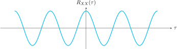
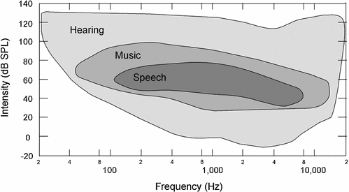

## Propiedades de la densidad espectral de potencia

- La densidad es siempre positiva  

\[ 
\mathcal{S}_{XX}(\omega) \geq 0 
\]

- La densidad tiene simetría par para \(X(t)\) real

\[
\mathcal{S}_{XX}(-\omega) = \mathcal{S}_{XX}(\omega)
\]

- La densidad \(\mathcal{S}_{XX}(\omega)\) es real.

- La potencia promedio se puede obtener a partir de la densidad espectral de potencia

\[   
\frac{1}{2\pi}\int_{-\infty}^{\infty}\mathcal{S}_{XX}(\omega) \, \mathrm{d}\omega = A\{ E[X^2(t)] \} = P_{XX}   
\]

- Aplican las propiedades de las ecuaciones diferenciales, donde \( \displaystyle \dot{X} = \frac{dX}{dt}\)  

\[
\mathcal{S}_{\dot{X}\dot{X}}(\omega) = \omega^2 \mathcal{S}_{XX} (\omega)
\]

- El espectro de densidad de potencia y el promedio temporal de la autocorrelación forman un par de transformada de Fourier  

\[
\begin{aligned}
    \frac{1}{2\pi}\int_{-\infty}^{\infty} \mathcal{S}_{XX}(\omega) e^{j\omega \tau} \, d\omega &= A[R_{XX}(t, t+\tau)] \\
    \mathcal{S}_{XX}(\omega) &= \int_{-\infty}^{\infty} A[R_{XX}(t, t+\tau)] e^{-j\omega \tau} \, d\tau
\end{aligned}
\]

   En esta propiedad 6 existe el caso especial en el que \(X(t)\) es al menos **WSS**.

---

## Ecuaciones de Wiener–Khinchin  
Relación entre el espectro de densidad de potencia y la correlación

!!! note "" 
    **Teorema de Wiener–Khinchin**

    Para un proceso \(X(t)\) estacionario en sentido amplio (*WSS*), donde \(A[R_{XX}(t,t+\tau)] = R_{XX}(\tau)\), la relación entre el espectro de densidad de potencia y la correlación está dada por:

    \[
    \mathcal{S}_{XX}(\omega) = \int_{-\infty}^{\infty} R_{XX}(\tau) e^{-j\omega \tau} \, \mathrm{d}\tau
    \]

    \[
    R_{XX}(\tau) = \frac{1}{2\pi} \int_{-\infty}^{\infty} \mathcal{S}_{XX}(\omega)e^{j\omega \tau} \, \mathrm{d}\omega
    \]

    que representan un par de transformada de Fourier.

---

## Espectro de potencia a partir de la función de autocorrelación

!!! note "" 
    **¿Cuál es el espectro de potencia para el proceso aleatorio** \( X(t) \) **con la siguiente autocorrelación?**

    \[
    R_{XX}(\tau) = \left( \frac{A^2}{2} \right) \cos(\omega_0 \tau)
    \]

La figura anterior muestra el comportamiento de la función de autocorrelación \( R_{XX}(\tau) \), la cual es una función cosenoidal centrada en el origen. Esta función describe cómo se correlacionan los valores del proceso \( X(t) \) en distintos retardos \( \tau \).

---

\[
\begin{aligned}
R_{XX}(\tau) &= \left( \frac{A^2}{2} \right) \left( \frac{1}{2} \right) \left( e^{j\omega_0 \tau} + e^{-j\omega_0 \tau} \right) \\
&= \frac{A^2}{4} \left( e^{j\omega_0 \tau} + e^{-j\omega_0 \tau} \right) \\
\mathcal{S}_{XX}(\omega) &= \mathcal{F}\{R_{XX}(\tau)\} \\
&= \frac{A^2}{4} \left[ 2\pi \delta(\omega - \omega_0) + 2\pi \delta(\omega + \omega_0) \right] \\
&= \frac{\pi A^2}{2} \left[ \delta(\omega - \omega_0) + \delta(\omega + \omega_0) \right]
\end{aligned}
\]

La figura anterior se presenta el espectro de potencia con deltas en ±ω₀ y amplitud πA²⁄2

---

## Ejemplo del rango audible del ser humano 

En la figura anterior se evidencia un audiograma de intensidad contra la frecuencia.

---

**Nivel de presión de sonido**

**SPL** (*Sound Pressure Level*) es una medida relativa de la audición de un humano, dada por:

\[
L_p = 10 \log \left( \frac{p^2}{p_{\mathsf{ref}}^2} \right)
\]

donde:

- \( p \) es el valor **RMS** de la presión de la onda acústica, en pascal (Pa).
- \( p_{\mathsf{ref}} \) es el valor de referencia de audición, establecido alrededor de 1000 Hz para una persona joven con audición normal.

Cuando \( \text{SPL} = L_p = 0 \, \text{dB} \), la intensidad del sonido es igual al sonido de referencia.

---

## Ruido blanco

!!! note "" 
     **Ruido blanco**  
     Una función muestra \( n(t) \) de un proceso aleatorio \( N(t) \) de ruido estacionario en sentido amplio, se llama *ruido blanco* si el espectro de densidad de potencia de \( N(t) \) es una constante en todas las frecuencias.

Así, se define:

\[
\mathcal{S}_{NN}(\omega) = \frac{\mathcal{N}_{0}}{2}
\tag{1}
\label{E:ruido_blanco}
\]

para ruido blanco, donde \( \mathcal{N}_{0} \) es una constante positiva real.

---

Ejemplo de "ruido blanco" (white noise).

---

Por la transformación inversa de Fourier, la autocorrelación de \( N(t) \) es:

\[
R_{NN}(\tau) = \left( \frac{\mathcal{N}_{0}}{2} \right) \delta(\tau)
\tag{2}
\label{E:ruido_blanco_autocorrelacion}
\]

El ruido blanco deriva su nombre por analogía con la luz blanca, que contiene todas las frecuencias de luz visible en su espectro.  

El ruido blanco **no** es realizable, puesto que posee potencia promedio infinita:

\[
\frac{1}{2\pi} \int_{-\infty}^{\infty} \mathcal{S}_{NN}(\omega) \, \mathrm{d}\omega = \infty
\tag{3}
\label{E:ruido_blanco_potencia}
\]

---

## Ruido térmico

!!! note "" 
     El ruido generado por la agitación térmica de electrones en cualquier conductor eléctrico tiene un espectro de potencia que es constante hasta muy altas frecuencias, y luego disminuye.

Por ejemplo, una resistencia a temperatura $T$ (en kelvin) produce un tensión eléctrica de ruido a través de sus terminales en circuito abierto con un espectro de potencia:

\[ 
\mathcal{S}_{NN}(\omega) = \frac{\mathcal{N}_0}{2} \frac{\alpha \vert \omega \vert/T}{e^{\alpha \vert \omega\vert/T}-1}
\]

donde \( \alpha = 7.64 \times 10^{-12} \) kelvin-segundo es una constante. Las unidades de \( \mathcal{S}_{NN}(\omega) \) son voltio cuadrado por hertz. De acuerdo con la convención, se obtiene watt/hertz suponiendo la corriente a través de una resistencia de \( 1\ \Omega \).

---

En la figura anterior se presenta el ejemplo de densidad espectral de potencia \( \mathcal{S}_{NN}(\omega) \) dependiente de la frecuencia, representando un proceso de ruido con menor intensidad en frecuencias altas.

ℹ️ A una temperatura de \( T = 290\,^\circ \mathrm{K} \) (usualmente llamada temperatura ambiente, aunque corresponde a \( 17\,^\circ \mathrm{C} \)), tal función permanece arriba de \( 0.9 \left( \mathcal{N}_{0}/2 \right) \) para frecuencias hasta de \( 10^{12} \) Hz, o 1000 GHz. Así, el ruido térmico tiene un espectro casi plano en aquellas frecuencias que son usadas en sistemas de radio, microondas u ondas milimétricas.

---

## Ruido blanco de banda limitada 

El ruido que tiene un espectro de potencia constante y no nulo sobre una banda de frecuencia finita y cero fuera de ella, se llama ruido blanco de banda limitada. Así, un ruido descrito por el siguiente espectro de potencia constituye un ejemplo:

\[
  \mathcal{S}_{NN}(\omega) = 
  \begin{cases}
  \displaystyle\frac{P\pi}{W} & \omega_{0} - \frac{W}{2} < \vert \omega \vert < \omega_{0} + \frac{W}{2} \\
  0 & \text{fuera de la banda}
  \end{cases}
\]

La transformación inversa da la autocorrelación correspondiente:

\[
  R_{NN}(\tau) = P \frac{\sin(W\tau)}{W\tau}
\]

La constante \( P \) es la potencia del ruido.

---

El ruido blanco de banda limitada puede también ser pasabanda, como el descrito por el siguiente espectro de potencia y su respectiva función de autocorrelación:

\[
  \mathcal{S}_{NN}(\omega) = 
  \begin{cases}
  \displaystyle\frac{P\pi}{W} & \omega_{0} - \frac{W}{2} < \vert \omega \vert < \omega_{0} + \frac{W}{2} \\
  0 & \text{fuera de la banda}
  \end{cases}
\]

\[
  R_{NN}(\tau) = P \cdot \frac{\sin\left(\frac{W\tau}{2}\right)}{\left(\frac{W\tau}{2}\right)} \cdot \cos(\omega_{0} \tau)
\]

donde \( \omega_0 \), \( W \) son constantes, y \( P \) es la potencia del ruido.

Por analogía con la luz coloreada (que contiene solo una parte del espectro de luz visible), se define ruido coloreado como cualquier ruido que no es blanco.

---

## Espectro de potencia de una señal de ruido

!!! note "" 
     Un proceso \( N(t) \) de ruido **wss** tiene una autocorrelación dada por:

    \[
    R_{NN}(\tau) = P e^{-3|\tau|}
    \]

     donde \( P \) es una constante. Se desea encontrar su espectro de densidad de potencia.

\[
\begin{aligned}
\mathcal{S}_{NN}(\omega) &= \int_{-\infty}^{\infty} P e^{-3|\tau|} e^{-j\omega \tau} d\tau \\
&= P \int_0^{\infty} e^{(-3 + j\omega)\tau} d\tau + P \int_{-\infty}^{0} e^{(3 - j\omega)\tau} d\tau \\
&= \frac{P}{3 + j\omega} + \frac{P}{3 - j\omega} \\
&= \frac{6P}{9 + \omega^2}
\end{aligned}
\]

---

### Videos y referencias en internet

 ▶️ **¿Cómo sabe Shazam qué canción está sonando?**  

  *Jaime Altozano*  [https://youtu.be/OE4gcdjFbmc](https://youtu.be/OE4gcdjFbmc)