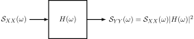

# Autocorrelaciones de entrada y salida y correlaciones cruzadas

!!! note ""
      

!!! note ""
      

---

## Autocorrelación de la respuesta

Sea $X(t)$ estacionario en sentido amplio. La autocorrelación de la respuesta  $Y(t)$ es:

\begin{equation}
\begin{aligned}
R_{YY}(t,t+\tau) =&\ E[Y(t)Y(t+\tau)] \\
=&\ E[\int_{-\infty}^{\infty}h(\xi_1)X(t-\xi_1)d\xi_1\int_{-\infty}^{\infty}h(\xi_2)X(t+\tau-\xi_2)d\xi_2] \\
=&\ \int_{-\infty}^{\infty}\int_{-\infty}^{\infty}E[X(t-\xi_1)X(t+\tau-\xi_2)]h(\xi_1)h(\xi_2)d\xi_1 d\xi_2 
\end{aligned}
\end{equation}

Como $ X(t) $ es estacionario en sentido amplio:

\begin{equation}
R_{YY}(\tau) = \int_{-\infty}^{\infty} \int_{-\infty}^{\infty} R_{XX}(\tau+\xi_1-\xi_2) h(\xi_1) h(\xi_2) \, d\xi_1 d\xi_2
\end{equation} 

pues $X(t)$ se supone que es estacionario en sentido amplio.

!!! note ""
    Se puede concluir que:

    1. $Y(t)$ es estacionario en sentido amplio si $X(t)$ es estacionario en sentido amplio porque $R_{YY}(\tau)$ no depende de $t$ y $E[Y(t)]$ es constante.
    2. $R_{YY}(\tau)$ es la doble convolución de la autocorrelación de entrada con la respuesta al impulso del sistema; es decir:

    \begin{equation} R_{YY}(\tau) = R_{XX}(\tau)\ast h(-\tau)\ast(\tau)
    \end{equation}

---

## Correlación cruzada de entrada y salida

La correlación cruzada $X(t)$ e $Y(t)$ es

\begin{equation} 
\begin{aligned}
R_{XY}(t, t+\tau) &= E[X(t)Y(t+\tau)] \\
&= E[X(t)\int_{-\infty}^{\infty} h(\xi)X(t+\tau - \xi) d\xi] \\
&= \int_{-\infty}^{\infty} E[X(t)X(t+\tau - \xi)]h(\xi) d\xi
\end{aligned}
\end{equation}

Si $X(t)$ es estacionario en sentido amplio,

\begin{equation}
R_{XY}(\tau) = \int_{-\infty}^{\infty} R_{XX}(\tau - \xi) h(\xi) \, d\xi 
\end{equation}

que es la convolución de $R_{XX}(\tau)$ con $h(\tau)$:

\begin{equation} R_{XY} = R_{XX}(\tau) \ast h(\tau)
\end{equation}

Un desarrollo simliar muestra que:

\begin{equation}
\begin{aligned}
R_{YX}(\tau) &= \int_{-\infty}^{\infty} R_{XX}(\tau - \xi) h(-\xi) \, d\xi \\
R_{YX} &= R_{XX}(\tau) \ast h(-\tau)
\end{aligned}
\end{equation}

Es claro que la correlación cruzada depende de $\tau$ y no del tiempo absoluto $t$. Como consecuencia de este hecho, $X(t)$ y $Y(t)$ son conjuntamente estacionario en sentido amplio si $X(t)$ es estacionario en sentido amplio (esto se concluye puesto que se demostró anteriormente que $Y(t)$ es estacionario en sentido amplio).

---

## Relaciones entre la autocorrelación y la correlación cruzada
La autocorrelación y la correlación cruzada están relacionados entre sí:

\begin{equation}
\begin{aligned}
R_{YY}(\tau) &= \int_{-\infty}^{\infty} R_{XY}(\tau + \xi_1) h(\xi_1) \, d\xi_1 \\
             &= R_{XY}(\tau) \ast h(-\tau)
\end{aligned}
\end{equation}

Igualmente,

\begin{equation}
\begin{aligned}
R_{YY}(\tau) &= \int_{-\infty}^{\infty} R_{YX}(\tau - \xi_2) h(\xi_2) \, d\xi_2 \\
             &= R_{YX}(\tau) \ast h(\tau)
\end{aligned}
\end{equation}

!!! note ""
 
      

---

# Características espectrales de la respuesta del sistema

- La transformada de Fourier de una función de correlación (autocorrelación o correlación cruzada) es un espectro de potencia para procesos estacionarios en sentido amplio.
- Si $R_{XX}(\tau)$ es conocida para el proceso de entrada, se puede hallar $R_{YY}(\tau)$, $R_{XY}(\tau)$ y $R_{YX}(\tau)$ como se ha descrito anteriormente, para luego obtener espectros de potencia por transformación.
- Desde un punto de vista práctico las integrales involucradas pueden ser difíciles de evaluar.
- El espectro de potencia deseado involucrando la respuesta del sistema se relaciona con el espectro de potencia de entrada.

---

## Espectro de densidad de potencia de la respuesta

Asumiendo estacionaridad en sentido amplio conjunta, escríbase $\mathcal{S}_{YY}(\omega)$ como la transformada de Fourier de la autorrelación de salida

\begin{equation} \mathcal{S}_{YY}(\omega) = \int_{-\infty}^{\infty} R_{YY}(\tau) e^{-j\omega \tau} \, d\tau
\end{equation}

Si se sustituye ahora la integral para \( R_{YY}(\tau) \)

\begin{equation}
\mathcal{S}_{YY}(\omega) = \int_{-\infty}^{\infty}h(\xi_{1})\int_{-\infty}^{\infty}h(\xi_2)\int_{-\infty}^{\infty}R_{XX}(\tau + \xi_{1} - \xi_{2})e^{-j\omega \tau} d_{\tau} d_{\xi_2} d_{\xi_1}
\end{equation}

Se hace ahora el cambio de variable $\xi = \tau + \xi_{1} - \xi_{2}$, $d_{\xi} = d_{\tau}$, se tiene:

\begin{equation}
  \mathcal{S}_{YY}(\omega) = \int_{-\infty}^{\infty}h(\xi_{1})e^{j\omega \xi_{1}} d_{\xi_1} \int_{-\infty}^{\infty}h(\xi_{2})e^{-j\omega \xi_{2}} d_{\xi_2} \int_{-\infty}^{\infty}R_{XX}(\xi)e^{-j\omega \xi} d_{\xi}
\end{equation}

Las anteriores tres integrales se reconocen como  $H^{\ast}(\omega)$, $H(\omega)$ y $\mathcal{S}_{XX}(\omega)$, respectivamente. 

\begin{equation}
\mathcal{S}_{YY}(\omega) = H^{\ast}(\omega)H(\omega)\mathcal{S}_{XX}(\omega) = \mathcal{S}_{XX}(\omega) \vert H(\omega) \vert^2
\end{equation}

$\vert H(\omega) \vert^2$ se llama la *función de transferencia de potencia del sistema*. 

!!! note ""
      

---

## Potencia promedio de la respuesta

La potencia promedio, denotada por $P_{YY}$, en la respuesta del sistema se encuentra calculando: 

\begin{equation}
  P_{YY} = \frac{1}{2\pi}\int_{-\infty}^{\infty}\mathcal{S}_{XX}(\omega)\vert H(\omega) \vert^2  d\omega
\end{equation} 
---

## Espectros de densidad de potencia cruzada de entrada y salida

Puede demostrarse que las transformadas de Fourier de las correlaciones cruzadas pueden escribirse como: 

\begin{equation} \begin{aligned}
  \mathcal{S}_{XY}(\omega) & = \mathcal{S}_{XX}(\omega)H(\omega) \\
  \mathcal{S}_{YX}(\omega) & = \mathcal{S}_{XX}(\omega)H(-\omega)
\end{aligned} \end{equation}