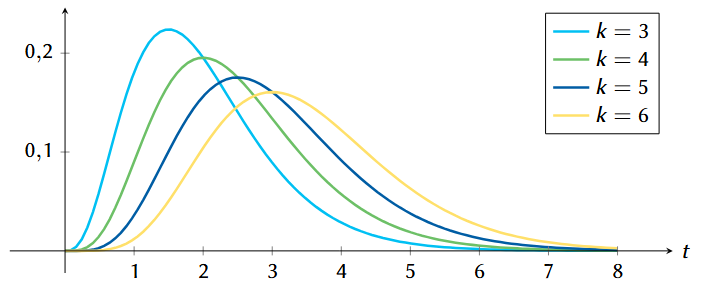
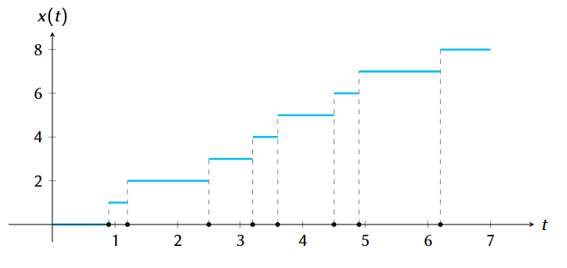
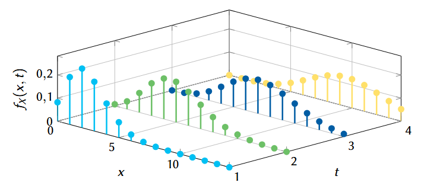

### Presentación

[17 - Proceso contador de Poisson](https://www.overleaf.com/read/ctgmjmgscrhj#116f35)

# Proceso aleatorio de Poisson

!!! note "Introducción"

    Un proceso aleatorio de Poisson describe el número de veces que algún evento ha ocurrido, como una función del tiempo o el espacio, y en donde los eventos ocurren en instantes o lugares al azar. 

    Ejemplos de situaciones que pueden describirse con este modelo incluyen:
    
    - La llegada de un cliente a la caja de supermercado.
    - La caída de un rayo dentro de un área prescrita.
    - La falla de un componente en un sistema.
    - La emisión de un electrón desde la superficie de un material sensible a la luz (fotodetector).
    - El número de solicitudes a un servidor.
    - El número de plantas en un área boscosa.

    El proceso se reduce a contar el número de tales ocurrencias con el tiempo. Por esta razón, el proceso también se conoce como **proceso contador de Poisson**.

---

## Definición del proceso de Poisson

!!! tip "Definición del proceso de Poisson"

    Sea \( X(t) \) el número de ocurrencias del evento con el tiempo (el proceso). Entonces \( X(t) \) consiste en funciones de valores enteros no-decrecientes. La probabilidad de que sucedan exactamente \( k \) eventos en el tiempo \( t \) está dada por:

    $$
    P(X = k) = \frac{(\lambda t)^k}{k!} e^{-\lambda t}, \quad k = 0, 1, 2, \ldots
    $$

    Por conveniencia, se toma \( X(t) = 0 \) en \( t = 0 \); para \( t > 0 \), \( X(t) \) es el número de ocurrencias en el intervalo \([0, t]\); para \( t < 0 \), \( X(t) \) es el negativo del número de ocurrencias en el intervalo \([t, 0]\).

<!-- Imagen opcional: gráfico con diferentes valores de k -->

---

!!! tip "Visualización del proceso"

    La evolución del proceso \( X(t) \) puede visualizarse como una función escalonada que aumenta en pasos unitarios en los puntos de ocurrencia del evento. Cada incremento representa un evento observado.

<!-- Imagen opcional: función escalonada x(t) -->

---

## Condiciones del proceso de Poisson

!!! tip "Condiciones que debe cumplir el proceso"

    - A la vez solamente ocurre un evento (aunque los tiempos puedan estar muy cerca).
    - Los tiempos de ocurrencia son estadísticamente independientes, de modo que el número de eventos en un intervalo dado es independiente del número en otro.
    - El número esperado de eventos crece de forma aproximadamente lineal con el tiempo.

    El número de ocurrencias de eventos en cualquier intervalo finito está descrito por la distribución de Poisson con tasa promedio \( \lambda \), también conocida como intensidad.

---

## Ejemplo: Contador de Geiger

!!! example "¿Cuál es la probabilidad de que en 30 segundos se reciba al menos un pulso?"

    Suponga que en un contador de Geiger llegan pulsos con una tasa promedio de 6 por minuto, de forma que \( \lambda = 6 \). Queremos conocer la probabilidad de que en un intervalo de 30 segundos (es decir, \( t = 0.5 \) minutos) al menos un pulso sea recibido.

    Como el número de pulsos sigue una distribución de Poisson con parámetro \( \lambda t = 3 \), se tiene:

    $$
    P(X \geq 1) = 1 - P(X = 0) = 1 - \frac{(3)^0}{0!} e^{-3} = 1 - e^{-3} \approx 0.95
    $$

!!! note ""
    Hay un 95 % de probabilidad de detectar al menos un pulso en 30 segundos.

---

# Funciones de densidad del proceso de Poisson

## Definición de la función de densidad

!!! tip "Función de densidad del proceso de Poisson"

    La probabilidad de exactamente \( k \) ocurrencias sobre un intervalo \([0, t]\) es:

    $$
    P[X(t) = k] = \frac{(\lambda t)^k}{k!} e^{-\lambda t}, \quad k = 0, 1, 2, \ldots
    $$

    La densidad de probabilidad del número de ocurrencias se puede escribir como:

    $$
    f_X(x) = \sum_{k=0}^{\infty} \frac{(\lambda t)^k}{k!} e^{-\lambda t} \delta(x - k)
    $$

---

!!! tip "Interpretación visual"

    La función de masa de probabilidad (PMF) del proceso Poisson representa la probabilidad de ocurrencia exacta de un número entero de eventos. A medida que el tiempo \( t \) aumenta, la dispersión de la distribución también aumenta, lo que se traduce en una mayor variabilidad del número de eventos esperados.

<!-- Imagen opcional: gráfico PMF discreto -->

---
