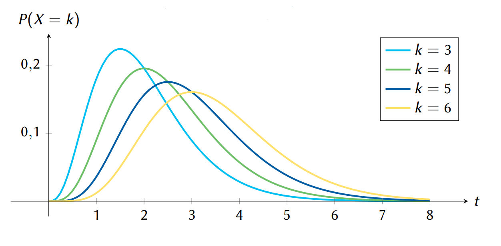
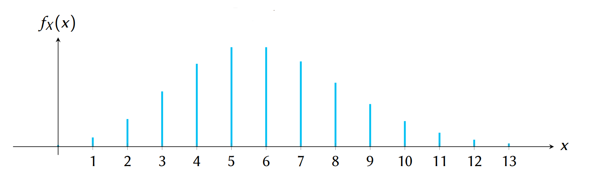

# Proceso Contador de Poisson

!!! note "Introducción"

    Un proceso aleatorio de Poisson describe el número de veces que un evento ocurre dentro de un intervalo de tiempo o espacio, en donde las ocurrencias son aleatorias, independientes y con una tasa constante. Es fundamental para modelar conteos en el tiempo, como llegadas de clientes, fallas de sistemas o eventos físicos aleatorios.

## Definición del proceso

Sea $X(t)$ el número de eventos ocurridos hasta el tiempo $t$. Se define como un proceso de Poisson si:

- $X(0) = 0$
- Los incrementos son independientes
- La probabilidad de $k$ eventos en un intervalo $(0, t)$ está dada por:

$$
P(X(t) = k) = \frac{{(\lambda t)^k}}{{k!}} e^{-\lambda t}, \quad k = 0, 1, 2, \ldots
$$

<!-- Imagen: gráfico que muestra varias curvas P(X=k) para distintos valores de k -->

## Propiedades del proceso de Poisson

- Solo ocurre un evento a la vez
- Los eventos en distintos intervalos no se afectan entre sí
- El número esperado de eventos en $[0, t]$ es igual a $E[X(t)] = \lambda t$ 
- El proceso tiene incrementos independientes y estacionarios

## Ejemplo: Contador Geiger

!!! example "Probabilidad de al menos un pulso en 30 segundos"

    Sea $\lambda = 6$ pulsos por minuto. En 30 segundos ($t = 0.5$ min), queremos:

    $$
    P(X \geq 1) = 1 - P(X = 0) = 1 - \frac{{3^0}}{{0!}}e^{-3} = 1 - e^{-3} \approx 0.95
    $$

!!! note ""
    Hay un 95 % de probabilidad de detectar al menos un pulso.

## Función de densidad del proceso de Poisson

La probabilidad de exactamente $k$ ocurrencias en $[0, t]$ también se puede escribir como:

$$
f_X(x) = \sum_{k=0}^{\infty} \frac{{(\lambda t)^k}}{{k!}} e^{-\lambda t} \delta(x - k)
$$

<!-- Imagen: función PMF discreta -->

## Momentos del proceso

- **Media:** $E[X(t)] = \lambda t$
- **Varianza:** ${\sigma^2}_X = \lambda t$
- **Desviación estándar:** ${\sigma}_X = \sqrt{\lambda t}$

## Probabilidad conjunta y condicional

Si $t_1 < t_2$, y $k_1$ eventos ocurren en $[0, t_1]$ y $k_2$ en $[0, t_2]$, entonces:

$$
P[X(t_2) = k_2 \mid X(t_1) = k_1] = \frac{{[\lambda(t_2 - t_1)]^{k_2 - k_1}}}{{(k_2 - k_1)!}} e^{-\lambda(t_2 - t_1)}
$$

!!! note ""
    Esta expresión refleja la propiedad de falta de memoria del proceso.

## Ejemplo: Consultorio médico

!!! example "Llegada de pacientes a un consultorio"

    La llegada de los pacientes a la oficina de cierto doctor se puede modelar por medio de un proceso de Poisson con tasa $\lambda = \frac{1}{10}$ minutos.  
    El doctor no verá a un paciente hasta que al menos tres pacientes se encuentren en la sala de espera.

    1️⃣ Encuentre el tiempo que debe esperar el primer paciente para ser atendido por el doctor. Asuma que los tiempos de espera se modelan exponencialmente.  
    2️⃣ ¿Cuál es la probabilidad de que nadie sea atendido en la primera hora?

---

!!! example "¿Cuánto espera el primer paciente?"

    Si $\lambda = 1/10$ llegadas por minuto, el doctor espera a que haya al menos 3 pacientes antes de atender. El tiempo esperado es:

    $$
    E[T_2] = 2 \cdot \frac{1}{\lambda} = 2 \cdot 10 = 20 \text{ minutos}
    $$

!!! example "¿Probabilidad de que nadie sea atendido en 1 hora?"

    Se requiere $X(60) \leq 2$ con $\lambda = 1/10$, entonces $\lambda t = 6$:

    $$
    P(X \leq 2) = e^{-6}(1 + 6 + 18) \approx 0.062
    $$

!!! note ""
    Hay un 6.2 % de probabilidad de que nadie sea atendido.

## Recursos adicionales

- [Video explicativo: ¿Poisson o no?](https://youtu.be/sv_KXSiorFk)

<!-- Fin del documento -->
