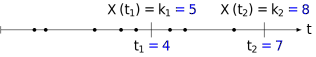
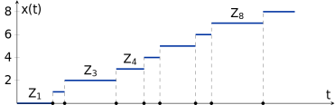
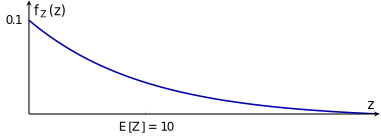

## Momentos de la distribución de Poisson 

### Momentos de la distribución de Poisson I

El **primer momento ordinario** (la media) es:

$$
E[X(t)] = \int_{-\infty}^{\infty} x \, f_{X}(x) \, dx
$$

$$
= \int_{-\infty}^{\infty} x \sum_{k=0}^{\infty} \frac{(\lambda t)^k e^{-\lambda t}}{k!} \delta(x - k) \, dx
$$

$$
= \sum_{k=0}^{\infty} \frac{k(\lambda t)^k e^{-\lambda t}}{k!}
$$

$$
\boxed{E[X(t)] = \lambda t}
$$

Este resultado implica que es un proceso **no estacionario**.

---
### Momentos de la distribución de Poisson II

El **segundo momento ordinario** es:

$$
E[X^2(t)] = \int_{-\infty}^{\infty} x^2 f_{X}(x) \, dx
$$

$$
= \sum_{k=0}^{\infty} \frac{k^2 (\lambda t)^k e^{-\lambda t}}{k!}
$$

$$
\boxed{E[X^2(t)] = \lambda t [1 + \lambda t]}
$$

---

La **varianza**, por tanto, es:

$$
\sigma_X^2 = E[X^2(t)] - E[X(t)]^2
$$

$$
= \lambda t + \lambda^2 t^2 - \lambda^2 t^2
$$

$$
\boxed{\sigma_X^2 = \lambda t}
\quad \text{con desviación estándar } \sigma_X = \sqrt{\lambda t}
$$

---

## Probabilidad conjunta y condicional del proceso de Poisson

### Densidad probabilística conjunta y condicional I 

!!! tip "Probabilidad conjunta"
    La probabilidad de que ocurran $k_1$ eventos en un tiempo $t_1$, **y que** ocurran otros $k_2 - k_1$ eventos en el intervalo de $t_1$ a $t_2$, para un total de $k_2$ eventos en $t_2$ unidades de tiempo.

!!! tip "Probabilidad condicional"
    La probabilidad de que ocurran $k_2 - k_1$ eventos en el intervalo de $t_1$ a $t_2$, **dado que** ocurrieron $k_1$ eventos en un tiempo $t_1$ (para un total de $k_2$ eventos en $t_2$ unidades de tiempo).

(Números en _azul_ de ejemplo).

---
### Densidad probabilística conjunta y condicional II

Para determinar la función de densidad probabilística conjunta para el proceso de Poisson en los tiempos \(0 < t_1 < t_2\), primero obsérvese que la probabilidad de \(k_1\) ocurrencias de eventos sobre \([0, t_1]\) es:

\[
  P[X(t_1) = k_1] = \frac{(\lambda t_1)^{k_1}}{k_1!} e^{-\lambda t_1} \quad k_1 = 0, 1, 2, \dots
\]

---
### Probabilidad condicional 

La probabilidad condicional de \(k_2\) ocurrencias sobre \([0,t_2]\) dado que \(k_1\) eventos ocurran sobre \([0,t_1]\), es la probabilidad de que \(k_2 - k_1\) eventos ocurran sobre \([t_1,t_2]\), la cual es, *debido a la propiedad de falta de memoria*,

\[
P[X(t_2) = k_2 \mid X(t_1) = k_1] = \frac{[\lambda (t_2 - t_1)]^{k_2 - k_1}}{(k_2 - k_1)!} e^{-\lambda (t_2 - t_1)}
\]

para \(k_2 \geq k_1\).

---

### Probabilidad conjunta

La probabilidad conjunta de \(k_2\) ocurrencias al tiempo \(t_2\) y \(k_1\) ocurrencias al tiempo \(t_1\) es el producto de los dos últimos resultados:

\[
\begin{aligned}
 P[X(t_1) = k_1 \cap X(t_2) = k_2] &= P[X(t_1) = k_1] \cdot P[X(t_2) = k_2 \mid X(t_1) = k_1] \\
 &= \frac{(\lambda t_1)^{k_1}[\lambda (t_2 - t_1)]^{k_2 - k_1}}{k_1 ! (k_2 - k_1)!} e^{-\lambda t_2} \quad k_2 \geq k_1
\end{aligned}
\]

"Fácilmente" deducible a partir de la relación básica de probabilidad condicional:

\[
P(A \mid B) = \frac{P(A \cap B)}{P(B)}
\]

---

### Función de densidad conjunta

La función de densidad conjunta es:

$$
f_X(x_1, x_2) = \sum_{k_1 = 0}^{\infty} \sum_{k_2 = k_1}^{\infty} P(k_1, k_2) \, \delta(x_1 - k_1) \, \delta(x_2 - k_2)
$$

para las variables aleatorias del proceso son $X(t_1) = X_1$ y $X(t_2) = X_2$.

---

:material-pencil-box: **EJEMPLO**

!!! example "Fila de espera de un consultorio"
    La llegada de los pacientes a la oficina de cierto doctor se puede modelar por medio de un proceso de Poisson con tasa \(\lambda = \frac{1}{10}\) minutos. El doctor no verá a un paciente hasta que al menos tres pacientes se encuentren en la sala de espera.

    1. Encuentre el tiempo que debe esperar el primer paciente para ser atendido por el doctor.  
    Asuma que los tiempos de espera se modelan exponencialmente.
    2. ¿Cuál es la probabilidad de que nadie sea atendido en la primera hora? 

Considerar que el tiempo de llegada de \(n\) clientes es:

\[
T_n = Z_1 + Z_2 + Z_3 + \ldots
\]

donde:

\[
Z \sim \mathsf{exponencial}(\lambda) \qquad 
f_Z(z) = \lambda e^{-\lambda z} \qquad 
E[Z] = \frac{1}{\lambda}
\]

---

**Parte 1**: *Encuentre el tiempo que debe esperar el primer paciente para ser atendido por el doctor. Asuma que los tiempos de espera se modelan exponencialmente.*

Sea \( T_{n} \) el tiempo de llegada del \( n \)-ésimo paciente a la oficina del doctor, entonces:

$$
T_{n} = Z_{1} + Z_{2} + \dots + Z_{n}
$$

donde \( \{Z_{n}\} \) para \( n = 1, 2, \dots \) son variables aleatorias exponensiales  e idénticamente distribuidas (i.i.d.) con el mismo parámetro \( \lambda = \frac{1}{10} \), que describen el tiempo de espera desde la última llegada de una persona.

Así entonces:

$$
E[T_{n}] = E\left[ \sum_{i=1}^{n} Z_{i} \right] = \sum_{i=1}^{n} E[Z_{i}] = n \cdot \frac{1}{\lambda}
$$

Considerando que la media de la función exponencial es \( 1/\lambda \).

Desde el punto de vista del primer paciente, que tiene que esperar (insensiblemente de parte del doctor) a que dos pacientes más lleguen para ser atendido, el tiempo promedio de espera desde el momento en que llega es de:

$$
E[T_2] = 2 \times 10 = 20 \text{ minutos}
$$

---

**Parte 2**: _¿Cuál es la probabilidad de que nadie sea atendido en la primera hora?_

Sea \( X(t) \) el proceso de Poisson con el parámetro \( \lambda = \frac{1}{10} \). La probabilidad de que nadie sea atendido en la primera hora es la misma probabilidad de que al menos dos pacientes lleguen en los primeros 60 minutos. Con \( \lambda t = 60 \times \frac{1}{10} = 6 \), se tiene que:

$$
\begin{aligned}
P[X(60) \leq 2] & = P[X(60) = 0] + P[X(60) = 1] + P[X(60) = 2] \\
& = \frac{6^0}{0!} e^{-6} + \frac{6^1}{1!} e^{-6} + \frac{6^2}{2!} e^{-6} \\
& = e^{-6} (1 + 6 + 18) \approx 0.062
\end{aligned}
$$

Por lo tanto, la probabilidad de que nadie sea atendido en la primera hora es de 6,2%.

---

## Videos y referencias en internet

- :video_camera: **Poisson or Not? (When does a random variable have a Poisson distribution?)**

  _jbstatistics_, [https://youtu.be/sv_KXSiorFk](https://youtu.be/sv_KXSiorFk)
